# Forge Credit Hub — components

## Barrel

App code imports from `@/components/forge` (see `components/forge/index.ts`).

## Phase 2 primitives (28 exports)

Presentational building blocks under `components/forge/ui/*` (and generic `layout/Sidebar`, `layout/Topbar` for previews):

Button, IconButton, Input, Textarea, Select, Checkbox, RadioGroup, Switch, Card, EmptyState (optional **`icon`**, **`tone="success"`** for passive positive framing), Badge, StatusPill, Skeleton, Avatar, Modal, Drawer, Toast (`ForgeToaster` + `toast`), Tabs, Breadcrumb, DataTable, KpiCard, MicroChart, EvidenceCard, AuditTimeline, CommandPalette, MoneyInput, DateInput, ConsentCapture.

These primitives are **persona-agnostic** (no `usePersona` / no layout segments).

### DataTable — mobile strategy

**Mobile strategy:** use **`density="compact"`** (or `dense`) plus **`overflow-x-auto`** on the table wrapper and **`min-w-0`** on text-heavy cells so small viewports scroll horizontally **inside** the table instead of breaking the page layout. Chunk 3 mobile screenshots (iPhone SE) confirmed no horizontal page scroll on dealer surfaces.

The master prompt originally suggested a separate **`<DataTableMobileCard>`** component for card-based mobile rows. That component **was not built**: the **density + scroll** approach was sufficient for dealer/bank table UX, and a density toggle preserves a real table on tablets where bankers and dealers often want columns. If a future tenant requires **cards-not-tables** on mobile, introduce `DataTableMobileCard` (or a `variant="cards"` on `DataTable`) then — the API surface is already considered.

### Button & IconButton (Phase 5 polish)

- **`Button` loading:** Inline spinner is **leading** (left of the label), never replacing the label. Matches common fintech defaults (Stripe / Linear). `aria-busy="true"` while `loading` is set; the element is `disabled` during loading to prevent double-submit.
- **`Button` disabled vs loading:** `disabled` alone → muted ink/surface (no spinner). `loading` → variant colors + leading spinner + `aria-busy`. If both props are true, **loading UI wins** (spinner + busy + frozen variant colors); callers should prefer **`loading` only** during submission instead of also forcing `disabled`.
- **`IconButton`:** `aria-label` is **required in TypeScript** on the primitive. Missing labels at call sites are bugs to fix in app code, not by loosening the primitive.
- **Focus ring:** `focus-visible:outline` **2px** `forgeBrand-500` + **2px** offset on both primitives. On very dark brand chrome, if the ring ever fails WCAG focus-indicator contrast against adjacent pixels, consider `forgeBrand-300` for that surface or a double-ring treatment — validate in `/credit-hub/preview` “Focus on surfaces” swatches before changing tokens.

### DataTable

- **Empty:** Zero rows render **`<EmptyState>`** inside the table (not a bare “no data” text row). Pass **`emptyDescription`** / **`emptyAction`** when you need copy + CTA beyond **`emptyLabel`**. Optional **`emptyIcon`** (decorative) and **`emptyTone="success"`** for positive “all clear” grids (Item 4).
- **Loading:** Set **`loading`** to show a skeleton **body** with the same column count as **`columns`** (use **`skeletonRowCount`** to tune height). The wrapper sets **`aria-busy`**.
- **Sort (optional):** If a column defines **`onSort`**, the header is a button with **`aria-sort`** reflecting **`sort`** (`ascending` | `descending` | `none`). Icons are decorative (`aria-hidden`).
- **Rows:** Body rows use a **subtle hover** background only (no transform / layout shift).

### Navigation — Tabs, Breadcrumb, CommandPalette (`layout/Sidebar`, `layout/Topbar`)

- **`Tabs` (`line`):** Active indicator **`border-forgeBrand-500`**; inactive baseline uses **`border-forgeInk-200`** (not a fully invisible underline) so the tab bar reads as a structured control strip.
- **`CommandPalette`:** **`closeOnBackdropClick`** (default `true`) mirrors Modal/Drawer backdrop policy for audits that need a non-dismissible surface. Supports **`groups`** (cmdk `Command.Group`), optional **controlled `search` / `onSearchChange`** for dynamic first-class rows (e.g. “search applications for …”), custom **`emptyMessage`** when filtering yields no commands, and **`keyboardShortcut={false}`** when **`ForgeCommandPaletteProvider`** owns **Ctrl+K / ⌘K** globally.
- **`ForgeCommandPaletteProvider`** (`components/forge/layout/ForgeCommandPaletteContext.tsx`): mounted inside **`ForgeCreditHubAppShell`**; registers **Ctrl+K / ⌘K**, restores focus after close, and renders **`ForgeCreditHubCommandPalette`** (`components/forge/layout/ForgeCreditHubCommandPalette.tsx` — persona-aware navigation, table-density deep links to **`/credit-hub/{persona}/applications?density=`**, AML/compliance shortcut, **“Switch institution (coming soon)”** dormant row, keyboard-shortcuts **Modal**). **`ForgeCreditHubTopbar`** adds a search **`IconButton`** calling **`useForgeCommandPalette().toggle`**. Labels use **`utils/forge-palette-copy.ts`** (EN/ES). **Telemetry:** none in repo — skipped.
- **`Topbar`:** **`actions`** slot carries global chrome (e.g. command palette) — compose **`Button`** / **`IconButton`** only (Group 2 sweep applies).

### Overlays — Modal, Drawer, Toast

- **`Modal` / `Drawer`:** **`closeOnBackdropClick`** (default `true`) — set `false` for non-dismissible flows (still use **`Esc`** / explicit close affordances). **`Modal`** uses native **`<dialog>`** light-dismiss when clicking the dialog element itself (backdrop hit target).
- **`ForgeToaster` (Sonner):** Toast surface includes **`motion-reduce:transition-none`** / **`motion-reduce:animate-none`** so auto-dismiss does not rely on motion for comprehension.
- **Mount policy (Item 3):** **`ForgeToaster`** is mounted **once** in **`ForgeCreditHubAppShell`** (all `/credit-hub/*` Forge routes). Legacy **`/credit/*`** routes that still use **`DocumentUploader`** mount a **separate** **`CreditForgeToaster`** in **`app/credit/layout.tsx`** so Sonner is available without duplicating per page. Do **not** add another `<ForgeToaster />` on individual pages under those shells.
- **Sonner options:** **`position="top-right"`**, **`visibleToasts={3}`**, per-call **`duration`** from callers (`toast.success(msg, { duration: … })`).
- **Dealer wizard autosave toasts:** Background **localStorage** autosave (10s) shows **at most one** subtle **info** success toast **per browser session** (`sessionStorage` gate); subsequent successful saves are **silent** (institutional preference for silent success over repeated affirmation). Autosave **failure** uses **`toast.warning`** with a **“Reintentar”** / **“Retry”** action that runs a manual save. Copy + EN/ES split lives in **`utils/forge-toast-copy.ts`** (`forgeWizardToasts`), keyed off **`useTenantConfig().tenantConfig.locale`** (Forge) or **`TenantSettings.language`** (legacy uploader) via **`forgeToastLangFromLocale`**. Bank decision + legacy document upload strings use the same helper module.

## Preview playground

**Canonical URL:** `/credit-hub/preview`

Static route: `app/(forge)/credit-hub/preview/page.tsx`.  
Next.js treats leading-underscore segments as **private folders**, so the playground is **not** under `_design/preview` in the filesystem; use the URL above in docs and links.

## App shell (Phase 3)

- **`ForgeCreditHubAppShell`** (`components/forge/layout/ForgeCreditHubAppShell.tsx`) wraps Credit Hub in `app/(forge)/credit-hub/layout.tsx`: sidebar, top bar, tenant guard, `data-portal` + **`data-tenant`** (from `useTenant` in `lib/credit-hub/hooks/useTenant.ts`).
- **`ForgeCreditHubSidebar`** / **`ForgeCreditHubTopbar`** consume **`usePersona()`** and **`TenantContext`** / i18n for labels — they **do not** import `useSelectedLayoutSegments`.

### Persona contract (Phase 8 refactor scope)

**Rule:** Every Forge file under `components/forge/ui/*` and every persona-aware layout module under `components/forge/layout/*` except the shell seam must consume **`usePersona()`** — **not** `useSelectedLayoutSegments()` directly.

**Single seam today:** `creditHubPersonaFromSegments.ts` is the **only** module that reads layout segments; it is called from **`ForgeCreditHubAppShell`** solely to **seed** `PersonaProvider`. Replacing that seam in Phase 8 is a **small, localized** change (swap segment resolver for tenant-driven persona feeding the same `PersonaProvider`).

### DEFERRED TO PHASE 8 — URL-derived persona (accepted debt)

**Current implementation:** Persona (`bank` | `dealer`) fed to `PersonaProvider` is derived from **`useSelectedLayoutSegments()`** via **`creditHubPersonaFromLayoutSegments()`** (implemented in `creditHubPersonaFromSegments.ts`), keyed off the first route segment under `/credit-hub` (`bank` / `dealer`). This **does not** meet the stricter “no URL-derived persona” guardrail from the Phase 3 brief.

**Target implementation:** Derive persona from **`TenantContext`** (and/or auth-derived role metadata) once Path A/B decisions allow extending tenant metadata **without** breaking other cores — see `TENANT_CONTEXT_EXTENSION.md` (ForgeBrandingProvider / Path B).

**Why deferred:** Correct fix requires coordinated **`TenantContext`** / Forge provider work — **explicitly Phase 8** territory; **`TenantContext.tsx` and `lib/credit-hub/hooks/useTenant.ts` remain unchanged** in Phases 2–4 per guardrails.

**Refactor scope:** Downstream components already use **`usePersona()`**; Phase 8 replaces **only** how `PersonaProvider` gets its `persona` prop (today: `ForgeCreditHubAppShell` + segment helper).

**Acceptance (Phase 8):** Phase 8 acceptance criteria will include **removing segment-based persona** in favor of tenant-driven (or role-driven) resolution, with regression checks on bank/dealer nav and `data-portal` styling.

**Interim risk acceptance:** URL ↔ persona alignment matches current folder layout (`bank/*`, `dealer/*`); no security boundary relies on persona today (server enforces `tenant_id` + JWT role).

## Lighthouse accessibility (Phase 4 gate)

**Gate hygiene (local / Windows — avoid false `__next_error__` shells):** Before a Lighthouse run that **gates** a merge or a phase sign-off, **stop every** local `next start` / `next dev` bound to the ports you use for audits (e.g. `3000`, `3010`, `3012`, `3013`, `3015`), **delete `.next`**, run **`npx next build --webpack`**, then start **exactly one** fresh **`npx next start -p <port>`** for the audit. Stale bundles or **two servers** on different ports can leave `curl` looking healthy while a headless run briefly hits a torn-down or half-updated process — symptoms match **`html#__next_error__`** in the saved JSON. If that selector appears, **discard the JSON**, clean as above, and re-run (see `_design/_inventory/lh_error_shell_diagnosis.md`).

**Canonical verification:** run against a **fresh** production build so HTML matches `app/layout.tsx` (viewport, lang) and client chunks are current:

```bash
npx next build --webpack
npx next start -p 3010
```

Then audit, for example:

```bash
npx lighthouse "http://localhost:3010/credit-hub/bank" --only-categories=accessibility --output=json --output-path="app/(forge)/credit-hub/_design/_inventory/lh-bank-dashboard-a11y.json"
```

**Why not only `next dev`:** a long-lived dev server can serve **stale** inlined viewport metadata after a root layout change; if Lighthouse still flags `meta-viewport` or misses heading fixes, restart dev or use `next start` as above.

### Windows: Lighthouse CLI and `chrome-launcher` (`EPERM` on temp cleanup)

On some Windows installs, `npx lighthouse` fails after the run with **`EPERM`** while `chrome-launcher` deletes its temp profile (`rmSync` on `%TEMP%\lighthouse.*`). The audit may still complete; if it does not, try **one** of these (in order of convenience):

1. **Pinned user data dir + project temp (recommended on Windows):** `chrome-launcher` also creates a throwaway profile under `%TEMP%` (or `.tmp\lighthouse.*` under the repo). If cleanup hits **`EPERM`**, point **`TMP` and `TEMP`** at a project folder you own, and pin Chromium’s profile:

   ```powershell
   New-Item -ItemType Directory -Force -Path ".\tmp\lh-chrome-profile",".\tmp\lh-tmp" | Out-Null
   $env:TEMP = (Resolve-Path ".\tmp\lh-tmp").Path
   $env:TMP = $env:TEMP
   $ud = (Resolve-Path ".\tmp\lh-chrome-profile").Path
   npx lighthouse "http://localhost:3012/credit-hub/dealer/applications/new/applicant" `
     --only-categories=accessibility --output=json `
     --output-path="app/(forge)/credit-hub/_design/_inventory/lh-dealer-applications-new-a11y.json" `
     --chrome-flags="--user-data-dir=$ud"
   ```

   If a second run still fails on `rmSync` of `lighthouse.*` under that folder (file still locked), wait a few seconds or use a **new** `.\tmp\lh-tmp-2` for `TEMP`/`TMP` for the next command.

   Use a **fresh** `next build --webpack` + `next start` first (same SOP as above).

2. **`--quiet` / logging:** some environments report fewer launcher races with `--quiet` (optional).

3. **Manual DevTools:** open the URL in Chrome → **Lighthouse** panel → Accessibility → **Analyze page load** → **Save as JSON** (or export) into the same `_design/_inventory/` filenames. This satisfies the Phase 4 gate when CLI is blocked locally.

4. **CI as canonical gate:** Linux CI agents typically do not hit this `EPERM`; keep Lighthouse in CI for regression if local Windows remains flaky.

**If none of the above work:** document the limitation in this section and rely on **CI + manual DevTools JSON** for evidence; do not block merges on a single machine’s launcher policy alone.

**Forge-specific fixes in tree:** root viewport allows zoom (`maximumScale: 5`); Credit Hub shell uses a **`<main id="main-content">`** landmark; sidebar and inline table actions meet **target-size**; `EmptyState` supports **`titleLevel`** so empty bands under an `h1` can use an **`h2`** title (heading order).

**Artifacts:** decoded final screenshots and full JSON live under `app/(forge)/credit-hub/_design/_inventory/` (see `INVESTIGATION_phase4_chunk1_gates.md`).

**Bank application detail (`/credit-hub/bank/applications/[applicationId]`):** a prior **HTTP 500** during document load led to a temporary **full-route** `next/dynamic(..., { ssr: false })` workaround. **SSR investigation** (`_design/_inventory/ssr_root_cause_phase4_detail.md`) showed a **clean `next build` + fresh `next start`** returns **200** with a **direct** import of `BankApplicationDetailView` — no `ssr: false` required on current builds. If a 500 reappears, capture **server stderr** and treat as **CAT E** (stale `.next` / old server process) until a stack trace proves a library (**CAT A/D**).

## Motion policy (Phase 7)

Forge **does not ship a JavaScript animation library**. Runtime uses **`lib/motion-stub.tsx`** only as a compatibility shim for legacy JSX that still references `motion.*` / `AnimatePresence`: motion-only props are stripped and the underlying DOM element is rendered. **New surfaces** must use **CSS transitions** or the **Web Animations API** where animation is truly required for comprehension (e.g. pull-to-refresh affordance). If a change “needs” a motion library, the animation is probably **decorative** — remove it instead.

## DataTable — pagination

`DataTable` **does not** embed page controls. Pagination lives at the **page level** when needed (URL-driven `page` / `pageSize` + buttons composing **`Button`**). Keep this pattern unless multiple unrelated tables need an identical pager API — then extract a **`Pagination`** primitive.

## Tooltips

Forge **does not use tooltips**. Prefer visible labels, helper text, `aria-describedby`, and inline descriptions. Tooltips fail on touch-first workflows and add cognitive load. If a surface seems to need a tooltip, the information probably belongs **visible** in the layout.


<!-- PHASE8_PRIMITIVE_CATALOG_START -->

> **Primitive catalog (scaffold):** Regenerate with `node tools/docs/generate-component-catalog.mjs`. Keep each `## Name` heading aligned with the source file basename for `docs:validate --strict`.


## AuditTimeline

**File:** `components/forge/ui/AuditTimeline.tsx` · **Lines:** 51

**Purpose:** Forge design-system primitive `AuditTimeline` — see barrel export in `components/forge/index.ts`. Legacy `components/credit-hub/**` is **out of scope** for this catalog (Phase 7.2 Case B).

**Primary props interface:** `AuditTimelineProps`

```ts
entries: AuditTimelineEntry[];
className?: string;
```

### Variants & states (preview)

Captured from [`/credit-hub/preview`](../preview) — regenerate via `npm run docs:components`.

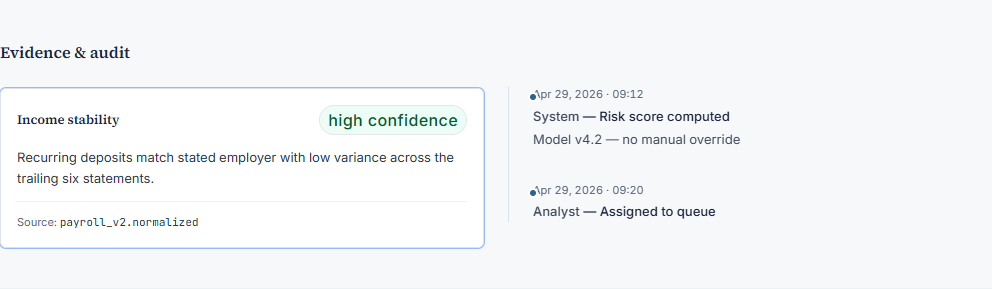

### DO / DON'T (from Phase 5 polish)

- **DO:** compose with tokens from [`TOKENS.md`](./TOKENS.md); meet focus-ring / target-size patterns in this file’s earlier sections.
- **DON'T:** add tooltips; ship `framer-motion` on new surfaces; hardcode tenant marketing strings in primitives.

### Accessibility

- Keyboard: focus order follows DOM; interactive cells use native controls or `role` + key handlers where applicable.
- See **Lighthouse accessibility** section above for gate hygiene.

### Minimal example

```tsx
import { AuditTimeline } from "@/components/forge";
```

### Related

- [`POLISH.md`](./POLISH.md) Phase 5 Items 2–5 · [`MIGRATION.md`](./MIGRATION.md)

### Compose vs extend

- **Compose** in page/feature modules under `components/forge/credit-hub/**`.
- **Extend** the primitive only when a new variant is reusable across personas (then update preview + this doc).

---

## Avatar

**File:** `components/forge/ui/Avatar.tsx` · **Lines:** 50

**Purpose:** Forge design-system primitive `Avatar` — see barrel export in `components/forge/index.ts`. Legacy `components/credit-hub/**` is **out of scope** for this catalog (Phase 7.2 Case B).

**Primary props interface:** `AvatarProps`

```ts
src?: string | null;
alt: string;
fallback?: string;
size?: AvatarSize;
className?: string;
```

### Variants & states (preview)

Captured from [`/credit-hub/preview`](../preview) — regenerate via `npm run docs:components`.

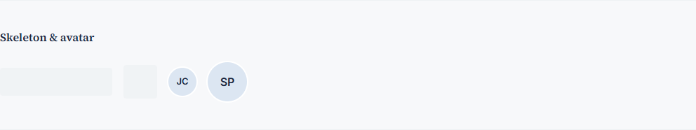

### DO / DON'T (from Phase 5 polish)

- **DO:** compose with tokens from [`TOKENS.md`](./TOKENS.md); meet focus-ring / target-size patterns in this file’s earlier sections.
- **DON'T:** add tooltips; ship `framer-motion` on new surfaces; hardcode tenant marketing strings in primitives.

### Accessibility

- Keyboard: focus order follows DOM; interactive cells use native controls or `role` + key handlers where applicable.
- See **Lighthouse accessibility** section above for gate hygiene.

### Minimal example

```tsx
import { Avatar } from "@/components/forge";
```

### Related

- [`POLISH.md`](./POLISH.md) Phase 5 Items 2–5 · [`MIGRATION.md`](./MIGRATION.md)

### Compose vs extend

- **Compose** in page/feature modules under `components/forge/credit-hub/**`.
- **Extend** the primitive only when a new variant is reusable across personas (then update preview + this doc).

---

## Badge

**File:** `components/forge/ui/Badge.tsx` · **Lines:** 34

**Purpose:** Forge design-system primitive `Badge` — see barrel export in `components/forge/index.ts`. Legacy `components/credit-hub/**` is **out of scope** for this catalog (Phase 7.2 Case B).

**Props:** See source for `export interface …Props` and runtime props.

### Variants & states (preview)

Captured from [`/credit-hub/preview`](../preview) — regenerate via `npm run docs:components`.

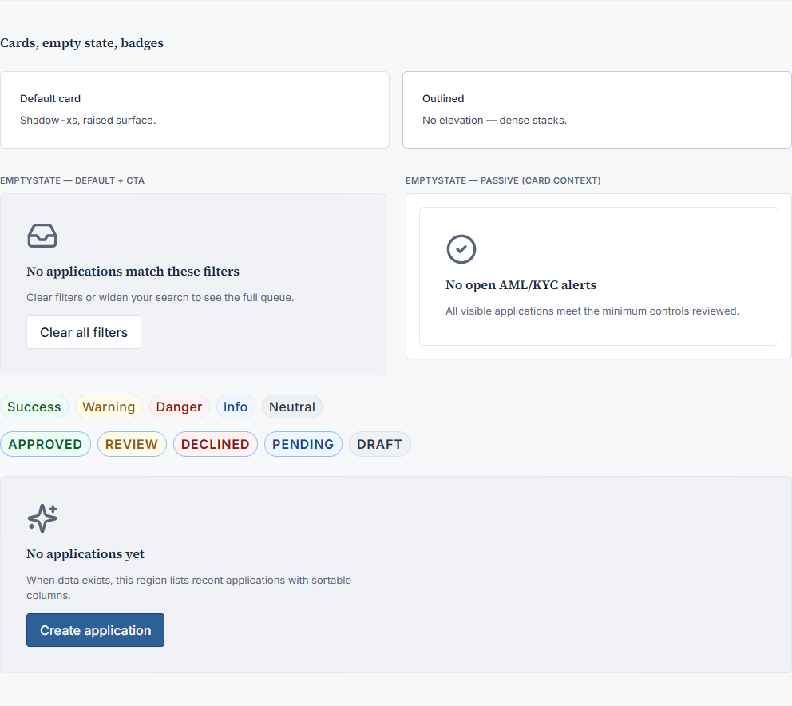

### DO / DON'T (from Phase 5 polish)

- **DO:** compose with tokens from [`TOKENS.md`](./TOKENS.md); meet focus-ring / target-size patterns in this file’s earlier sections.
- **DON'T:** add tooltips; ship `framer-motion` on new surfaces; hardcode tenant marketing strings in primitives.

### Accessibility

- Keyboard: focus order follows DOM; interactive cells use native controls or `role` + key handlers where applicable.
- See **Lighthouse accessibility** section above for gate hygiene.

### Minimal example

```tsx
import { Badge } from "@/components/forge";
```

### Related

- [`POLISH.md`](./POLISH.md) Phase 5 Items 2–5 · [`MIGRATION.md`](./MIGRATION.md)

### Compose vs extend

- **Compose** in page/feature modules under `components/forge/credit-hub/**`.
- **Extend** the primitive only when a new variant is reusable across personas (then update preview + this doc).

---

## Breadcrumb

**File:** `components/forge/ui/Breadcrumb.tsx` · **Lines:** 42

**Purpose:** Forge design-system primitive `Breadcrumb` — see barrel export in `components/forge/index.ts`. Legacy `components/credit-hub/**` is **out of scope** for this catalog (Phase 7.2 Case B).

**Primary props interface:** `BreadcrumbProps`

```ts
items: BreadcrumbItem[];
className?: string;
```

### Variants & states (preview)

Captured from [`/credit-hub/preview`](../preview) — regenerate via `npm run docs:components`.

_No dedicated capture slice yet — use full preview section or add capture mapping in `generate-component-catalog.mjs`._

### DO / DON'T (from Phase 5 polish)

- **DO:** compose with tokens from [`TOKENS.md`](./TOKENS.md); meet focus-ring / target-size patterns in this file’s earlier sections.
- **DON'T:** add tooltips; ship `framer-motion` on new surfaces; hardcode tenant marketing strings in primitives.

### Accessibility

- Keyboard: focus order follows DOM; interactive cells use native controls or `role` + key handlers where applicable.
- See **Lighthouse accessibility** section above for gate hygiene.

### Minimal example

```tsx
import { Breadcrumb } from "@/components/forge";
```

### Related

- [`POLISH.md`](./POLISH.md) Phase 5 Items 2–5 · [`MIGRATION.md`](./MIGRATION.md)

### Compose vs extend

- **Compose** in page/feature modules under `components/forge/credit-hub/**`.
- **Extend** the primitive only when a new variant is reusable across personas (then update preview + this doc).

---

## Button

**File:** `components/forge/ui/Button.tsx` · **Lines:** 114

**Purpose:** Forge design-system primitive `Button` — see barrel export in `components/forge/index.ts`. Legacy `components/credit-hub/**` is **out of scope** for this catalog (Phase 7.2 Case B).

**Props:** See source for `export interface …Props` and runtime props.

### Variants & states (preview)

Captured from [`/credit-hub/preview`](../preview) — regenerate via `npm run docs:components`.

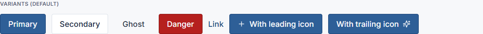

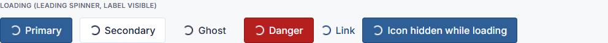

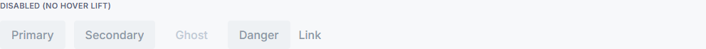

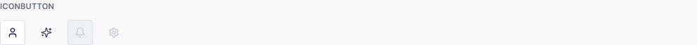

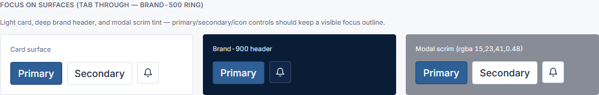

### DO / DON'T (from Phase 5 polish)

- **DO:** compose with tokens from [`TOKENS.md`](./TOKENS.md); meet focus-ring / target-size patterns in this file’s earlier sections.
- **DON'T:** add tooltips; ship `framer-motion` on new surfaces; hardcode tenant marketing strings in primitives.

### Accessibility

- Keyboard: focus order follows DOM; interactive cells use native controls or `role` + key handlers where applicable.
- See **Lighthouse accessibility** section above for gate hygiene.

### Minimal example

```tsx
import { Button } from "@/components/forge";
```

### Related

- [`POLISH.md`](./POLISH.md) Phase 5 Items 2–5 · [`MIGRATION.md`](./MIGRATION.md)

### Compose vs extend

- **Compose** in page/feature modules under `components/forge/credit-hub/**`.
- **Extend** the primitive only when a new variant is reusable across personas (then update preview + this doc).

---

## Card

**File:** `components/forge/ui/Card.tsx` · **Lines:** 21

**Purpose:** Forge design-system primitive `Card` — see barrel export in `components/forge/index.ts`. Legacy `components/credit-hub/**` is **out of scope** for this catalog (Phase 7.2 Case B).

**Props:** See source for `export interface …Props` and runtime props.

### Variants & states (preview)

Captured from [`/credit-hub/preview`](../preview) — regenerate via `npm run docs:components`.


### DO / DON'T (from Phase 5 polish)

- **DO:** compose with tokens from [`TOKENS.md`](./TOKENS.md); meet focus-ring / target-size patterns in this file’s earlier sections.
- **DON'T:** add tooltips; ship `framer-motion` on new surfaces; hardcode tenant marketing strings in primitives.

### Accessibility

- Keyboard: focus order follows DOM; interactive cells use native controls or `role` + key handlers where applicable.
- See **Lighthouse accessibility** section above for gate hygiene.

### Minimal example

```tsx
import { Card } from "@/components/forge";
```

### Related

- [`POLISH.md`](./POLISH.md) Phase 5 Items 2–5 · [`MIGRATION.md`](./MIGRATION.md)

### Compose vs extend

- **Compose** in page/feature modules under `components/forge/credit-hub/**`.
- **Extend** the primitive only when a new variant is reusable across personas (then update preview + this doc).

---

## Checkbox

**File:** `components/forge/ui/Checkbox.tsx` · **Lines:** 51

**Purpose:** Forge design-system primitive `Checkbox` — see barrel export in `components/forge/index.ts`. Legacy `components/credit-hub/**` is **out of scope** for this catalog (Phase 7.2 Case B).

**Props:** See source for `export interface …Props` and runtime props.

### Variants & states (preview)

Captured from [`/credit-hub/preview`](../preview) — regenerate via `npm run docs:components`.

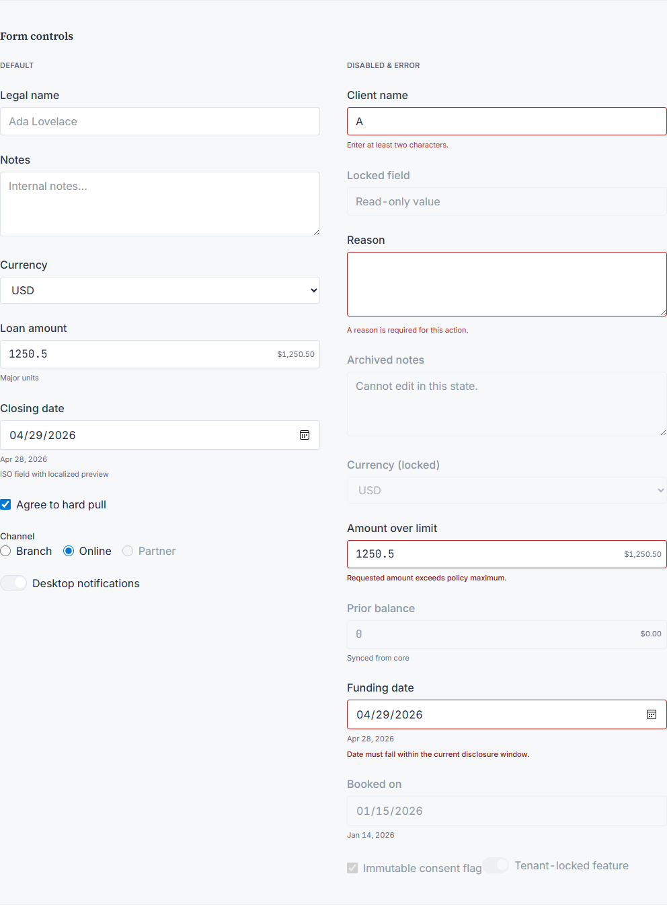

### DO / DON'T (from Phase 5 polish)

- **DO:** compose with tokens from [`TOKENS.md`](./TOKENS.md); meet focus-ring / target-size patterns in this file’s earlier sections.
- **DON'T:** add tooltips; ship `framer-motion` on new surfaces; hardcode tenant marketing strings in primitives.

### Accessibility

- Keyboard: focus order follows DOM; interactive cells use native controls or `role` + key handlers where applicable.
- See **Lighthouse accessibility** section above for gate hygiene.

### Minimal example

```tsx
import { Checkbox } from "@/components/forge";
```

### Related

- [`POLISH.md`](./POLISH.md) Phase 5 Items 2–5 · [`MIGRATION.md`](./MIGRATION.md)

### Compose vs extend

- **Compose** in page/feature modules under `components/forge/credit-hub/**`.
- **Extend** the primitive only when a new variant is reusable across personas (then update preview + this doc).

---

## CommandPalette

**File:** `components/forge/ui/CommandPalette.tsx` · **Lines:** 165

**Purpose:** Forge design-system primitive `CommandPalette` — see barrel export in `components/forge/index.ts`. Legacy `components/credit-hub/**` is **out of scope** for this catalog (Phase 7.2 Case B).

**Primary props interface:** `CommandPaletteProps`

```ts
open: boolean;
onOpenChange: (open: boolean) => void;
/** Flat list (single “Actions” group). Ignored if `groups` is set. */
actions?: CommandPaletteAction[];
/** Grouped commands (cmdk `Command.Group`). */
groups?: CommandPaletteGroup[];
/** Controlled filter box so parents can derive dynamic commands from `search`. */
search?: string;
onSearchChange?: (value: string) => void;
placeholder?: string;
className?: string;
closeOnBackdropClick?: boolean;
/** When false, does not register ⌘K / Ctrl+K (default true). */
keyboardShortcut?: boolean;
emptyMessage?: string;
```

### Variants & states (preview)

Captured from [`/credit-hub/preview`](../preview) — regenerate via `npm run docs:components`.

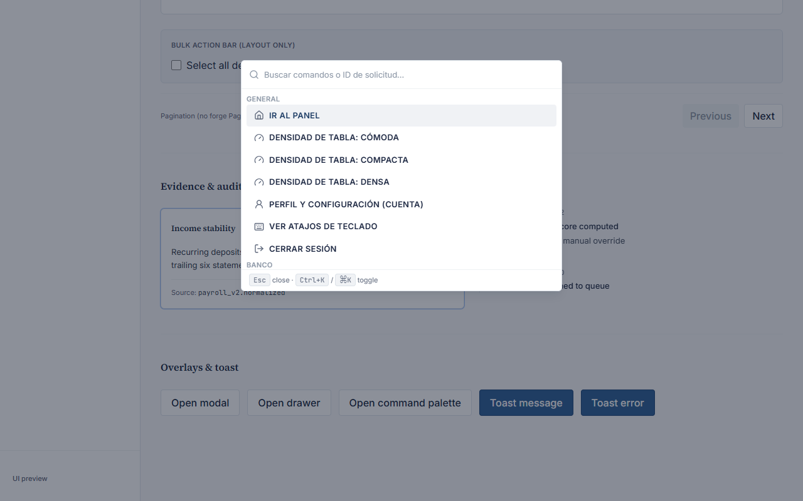

### DO / DON'T (from Phase 5 polish)

- **DO:** compose with tokens from [`TOKENS.md`](./TOKENS.md); meet focus-ring / target-size patterns in this file’s earlier sections.
- **DON'T:** add tooltips; ship `framer-motion` on new surfaces; hardcode tenant marketing strings in primitives.

### Accessibility

- Keyboard: focus order follows DOM; interactive cells use native controls or `role` + key handlers where applicable.
- See **Lighthouse accessibility** section above for gate hygiene.

### Minimal example

```tsx
import { CommandPalette } from "@/components/forge";
```

### Related

- [`POLISH.md`](./POLISH.md) Phase 5 Items 2–5 · [`MIGRATION.md`](./MIGRATION.md)

### Compose vs extend

- **Compose** in page/feature modules under `components/forge/credit-hub/**`.
- **Extend** the primitive only when a new variant is reusable across personas (then update preview + this doc).

---

## ConsentCapture

**File:** `components/forge/ui/ConsentCapture.tsx` · **Lines:** 41

**Purpose:** Forge design-system primitive `ConsentCapture` — see barrel export in `components/forge/index.ts`. Legacy `components/credit-hub/**` is **out of scope** for this catalog (Phase 7.2 Case B).

**Primary props interface:** `ConsentCaptureProps`

```ts
checked: boolean;
onCheckedChange: (checked: boolean) => void;
/** Accessible name for the consent control (visible copy lives in `children`). */
consentAriaLabel: string;
/** Visible consent copy (plain text or rich layout from caller). */
children: ReactNode;
disabled?: boolean;
className?: string;
```

### Variants & states (preview)

Captured from [`/credit-hub/preview`](../preview) — regenerate via `npm run docs:components`.

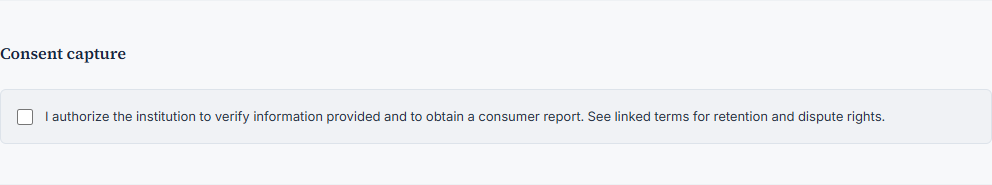

### DO / DON'T (from Phase 5 polish)

- **DO:** compose with tokens from [`TOKENS.md`](./TOKENS.md); meet focus-ring / target-size patterns in this file’s earlier sections.
- **DON'T:** add tooltips; ship `framer-motion` on new surfaces; hardcode tenant marketing strings in primitives.

### Accessibility

- Keyboard: focus order follows DOM; interactive cells use native controls or `role` + key handlers where applicable.
- See **Lighthouse accessibility** section above for gate hygiene.

### Minimal example

```tsx
import { ConsentCapture } from "@/components/forge";
```

### Related

- [`POLISH.md`](./POLISH.md) Phase 5 Items 2–5 · [`MIGRATION.md`](./MIGRATION.md)

### Compose vs extend

- **Compose** in page/feature modules under `components/forge/credit-hub/**`.
- **Extend** the primitive only when a new variant is reusable across personas (then update preview + this doc).

---

## DataTable

**File:** `components/forge/ui/DataTable.tsx` · **Lines:** 182

**Purpose:** Forge design-system primitive `DataTable` — see barrel export in `components/forge/index.ts`. Legacy `components/credit-hub/**` is **out of scope** for this catalog (Phase 7.2 Case B).

**Props:** See source for `export interface …Props` and runtime props.

### Variants & states (preview)

Captured from [`/credit-hub/preview`](../preview) — regenerate via `npm run docs:components`.

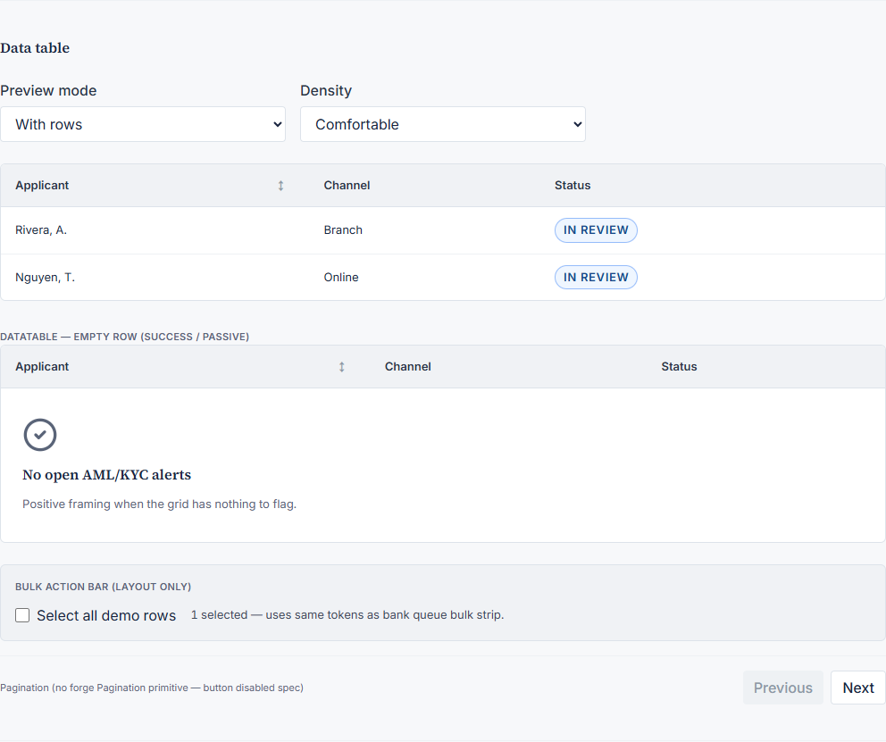

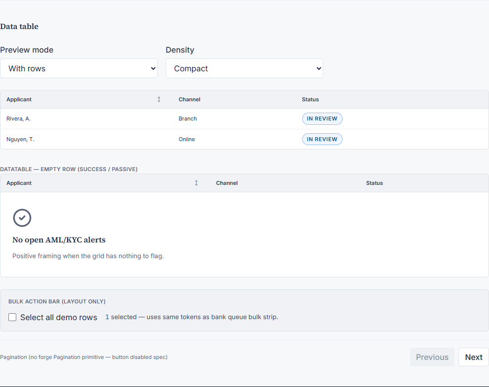

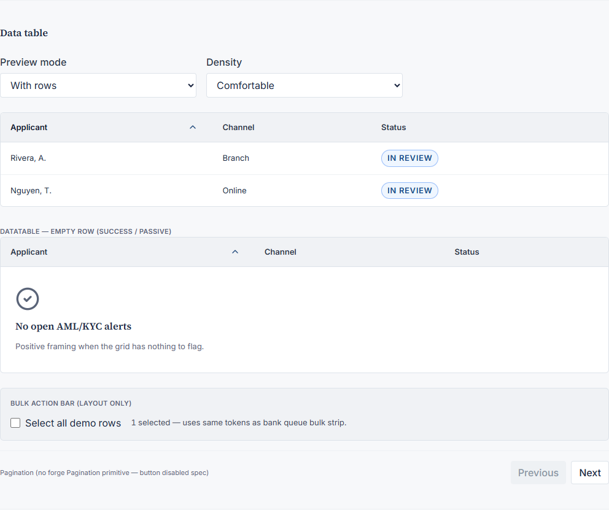

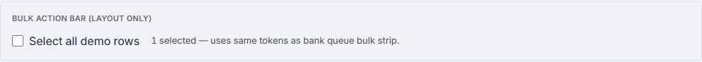

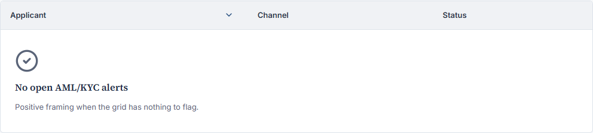

### DO / DON'T (from Phase 5 polish)

- **DO:** compose with tokens from [`TOKENS.md`](./TOKENS.md); meet focus-ring / target-size patterns in this file’s earlier sections.
- **DON'T:** add tooltips; ship `framer-motion` on new surfaces; hardcode tenant marketing strings in primitives.

### Accessibility

- Keyboard: focus order follows DOM; interactive cells use native controls or `role` + key handlers where applicable.
- See **Lighthouse accessibility** section above for gate hygiene.

### Minimal example

```tsx
import { DataTable } from "@/components/forge";
```

### Related

- [`POLISH.md`](./POLISH.md) Phase 5 Items 2–5 · [`MIGRATION.md`](./MIGRATION.md)

### Compose vs extend

- **Compose** in page/feature modules under `components/forge/credit-hub/**`.
- **Extend** the primitive only when a new variant is reusable across personas (then update preview + this doc).

---

## DateInput

**File:** `components/forge/ui/DateInput.tsx` · **Lines:** 69

**Purpose:** Forge design-system primitive `DateInput` — see barrel export in `components/forge/index.ts`. Legacy `components/credit-hub/**` is **out of scope** for this catalog (Phase 7.2 Case B).

**Props:** See source for `export interface …Props` and runtime props.

### Variants & states (preview)

Captured from [`/credit-hub/preview`](../preview) — regenerate via `npm run docs:components`.

_No dedicated capture slice yet — use full preview section or add capture mapping in `generate-component-catalog.mjs`._

### DO / DON'T (from Phase 5 polish)

- **DO:** compose with tokens from [`TOKENS.md`](./TOKENS.md); meet focus-ring / target-size patterns in this file’s earlier sections.
- **DON'T:** add tooltips; ship `framer-motion` on new surfaces; hardcode tenant marketing strings in primitives.

### Accessibility

- Keyboard: focus order follows DOM; interactive cells use native controls or `role` + key handlers where applicable.
- See **Lighthouse accessibility** section above for gate hygiene.

### Minimal example

```tsx
import { DateInput } from "@/components/forge";
```

### Related

- [`POLISH.md`](./POLISH.md) Phase 5 Items 2–5 · [`MIGRATION.md`](./MIGRATION.md)

### Compose vs extend

- **Compose** in page/feature modules under `components/forge/credit-hub/**`.
- **Extend** the primitive only when a new variant is reusable across personas (then update preview + this doc).

---

## Drawer

**File:** `components/forge/ui/Drawer.tsx` · **Lines:** 98

**Purpose:** Forge design-system primitive `Drawer` — see barrel export in `components/forge/index.ts`. Legacy `components/credit-hub/**` is **out of scope** for this catalog (Phase 7.2 Case B).

**Primary props interface:** `DrawerProps`

```ts
open: boolean;
onClose: () => void;
title: string;
description?: string;
children: ReactNode;
footer?: ReactNode;
side?: "left" | "right";
className?: string;
/** When false, clicking outside the panel does not dismiss (default true). */
closeOnBackdropClick?: boolean;
```

### Variants & states (preview)

Captured from [`/credit-hub/preview`](../preview) — regenerate via `npm run docs:components`.

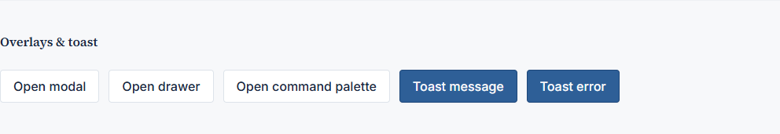

### DO / DON'T (from Phase 5 polish)

- **DO:** compose with tokens from [`TOKENS.md`](./TOKENS.md); meet focus-ring / target-size patterns in this file’s earlier sections.
- **DON'T:** add tooltips; ship `framer-motion` on new surfaces; hardcode tenant marketing strings in primitives.

### Accessibility

- Keyboard: focus order follows DOM; interactive cells use native controls or `role` + key handlers where applicable.
- See **Lighthouse accessibility** section above for gate hygiene.

### Minimal example

```tsx
import { Drawer } from "@/components/forge";
```

### Related

- [`POLISH.md`](./POLISH.md) Phase 5 Items 2–5 · [`MIGRATION.md`](./MIGRATION.md)

### Compose vs extend

- **Compose** in page/feature modules under `components/forge/credit-hub/**`.
- **Extend** the primitive only when a new variant is reusable across personas (then update preview + this doc).

---

## EmptyState

**File:** `components/forge/ui/EmptyState.tsx` · **Lines:** 42

**Purpose:** Forge design-system primitive `EmptyState` — see barrel export in `components/forge/index.ts`. Legacy `components/credit-hub/**` is **out of scope** for this catalog (Phase 7.2 Case B).

**Primary props interface:** `EmptyStateProps`

```ts
/** Decorative icon (e.g. Lucide); wrapped with `aria-hidden`. */
icon?: ReactNode;
title: string;
/** Heading level for the title (default 3). Use 2 after a page-level `h1` so the outline stays sequential. */
titleLevel?: 2 | 3;
description?: string;
action?: ReactNode;
className?: string;
/** Passive positive framing (e.g. compliance “all clear”). */
tone?: "default" | "success";
```

### Variants & states (preview)

Captured from [`/credit-hub/preview`](../preview) — regenerate via `npm run docs:components`.


### DO / DON'T (from Phase 5 polish)

- **DO:** compose with tokens from [`TOKENS.md`](./TOKENS.md); meet focus-ring / target-size patterns in this file’s earlier sections.
- **DON'T:** add tooltips; ship `framer-motion` on new surfaces; hardcode tenant marketing strings in primitives.

### Accessibility

- Keyboard: focus order follows DOM; interactive cells use native controls or `role` + key handlers where applicable.
- See **Lighthouse accessibility** section above for gate hygiene.

### Minimal example

```tsx
import { EmptyState } from "@/components/forge";
```

### Related

- [`POLISH.md`](./POLISH.md) Phase 5 Items 2–5 · [`MIGRATION.md`](./MIGRATION.md)

### Compose vs extend

- **Compose** in page/feature modules under `components/forge/credit-hub/**`.
- **Extend** the primitive only when a new variant is reusable across personas (then update preview + this doc).

---

## EvidenceCard

**File:** `components/forge/ui/EvidenceCard.tsx` · **Lines:** 42

**Purpose:** Forge design-system primitive `EvidenceCard` — see barrel export in `components/forge/index.ts`. Legacy `components/credit-hub/**` is **out of scope** for this catalog (Phase 7.2 Case B).

**Primary props interface:** `EvidenceCardProps`

```ts
title: string;
body: ReactNode;
sourceLabel: string;
confidence?: "high" | "medium" | "low";
className?: string;
```

### Variants & states (preview)

Captured from [`/credit-hub/preview`](../preview) — regenerate via `npm run docs:components`.


### DO / DON'T (from Phase 5 polish)

- **DO:** compose with tokens from [`TOKENS.md`](./TOKENS.md); meet focus-ring / target-size patterns in this file’s earlier sections.
- **DON'T:** add tooltips; ship `framer-motion` on new surfaces; hardcode tenant marketing strings in primitives.

### Accessibility

- Keyboard: focus order follows DOM; interactive cells use native controls or `role` + key handlers where applicable.
- See **Lighthouse accessibility** section above for gate hygiene.

### Minimal example

```tsx
import { EvidenceCard } from "@/components/forge";
```

### Related

- [`POLISH.md`](./POLISH.md) Phase 5 Items 2–5 · [`MIGRATION.md`](./MIGRATION.md)

### Compose vs extend

- **Compose** in page/feature modules under `components/forge/credit-hub/**`.
- **Extend** the primitive only when a new variant is reusable across personas (then update preview + this doc).

---

## IconButton

**File:** `components/forge/ui/IconButton.tsx` · **Lines:** 37

**Purpose:** Forge design-system primitive `IconButton` — see barrel export in `components/forge/index.ts`. Legacy `components/credit-hub/**` is **out of scope** for this catalog (Phase 7.2 Case B).

**Props:** See source for `export interface …Props` and runtime props.

### Variants & states (preview)

Captured from [`/credit-hub/preview`](../preview) — regenerate via `npm run docs:components`.

_No dedicated capture slice yet — use full preview section or add capture mapping in `generate-component-catalog.mjs`._

### DO / DON'T (from Phase 5 polish)

- **DO:** compose with tokens from [`TOKENS.md`](./TOKENS.md); meet focus-ring / target-size patterns in this file’s earlier sections.
- **DON'T:** add tooltips; ship `framer-motion` on new surfaces; hardcode tenant marketing strings in primitives.

### Accessibility

- Keyboard: focus order follows DOM; interactive cells use native controls or `role` + key handlers where applicable.
- See **Lighthouse accessibility** section above for gate hygiene.

### Minimal example

```tsx
import { IconButton } from "@/components/forge";
```

### Related

- [`POLISH.md`](./POLISH.md) Phase 5 Items 2–5 · [`MIGRATION.md`](./MIGRATION.md)

### Compose vs extend

- **Compose** in page/feature modules under `components/forge/credit-hub/**`.
- **Extend** the primitive only when a new variant is reusable across personas (then update preview + this doc).

---

## Input

**File:** `components/forge/ui/Input.tsx` · **Lines:** 71

**Purpose:** Forge design-system primitive `Input` — see barrel export in `components/forge/index.ts`. Legacy `components/credit-hub/**` is **out of scope** for this catalog (Phase 7.2 Case B).

**Props:** See source for `export interface …Props` and runtime props.

### Variants & states (preview)

Captured from [`/credit-hub/preview`](../preview) — regenerate via `npm run docs:components`.


### DO / DON'T (from Phase 5 polish)

- **DO:** compose with tokens from [`TOKENS.md`](./TOKENS.md); meet focus-ring / target-size patterns in this file’s earlier sections.
- **DON'T:** add tooltips; ship `framer-motion` on new surfaces; hardcode tenant marketing strings in primitives.

### Accessibility

- Keyboard: focus order follows DOM; interactive cells use native controls or `role` + key handlers where applicable.
- See **Lighthouse accessibility** section above for gate hygiene.

### Minimal example

```tsx
import { Input } from "@/components/forge";
```

### Related

- [`POLISH.md`](./POLISH.md) Phase 5 Items 2–5 · [`MIGRATION.md`](./MIGRATION.md)

### Compose vs extend

- **Compose** in page/feature modules under `components/forge/credit-hub/**`.
- **Extend** the primitive only when a new variant is reusable across personas (then update preview + this doc).

---

## KpiCard

**File:** `components/forge/ui/KpiCard.tsx` · **Lines:** 26

**Purpose:** Forge design-system primitive `KpiCard` — see barrel export in `components/forge/index.ts`. Legacy `components/credit-hub/**` is **out of scope** for this catalog (Phase 7.2 Case B).

**Primary props interface:** `KpiCardProps`

```ts
label: string;
value: ReactNode;
icon?: LucideIcon;
trend?: KpiCardTrend; // direction, value, label
hint?: string;
className?: string;
```

### Variants & states (preview)

Captured from [`/credit-hub/preview`](../preview) — regenerate via `npm run docs:components`.

_No dedicated capture slice yet — use full preview section or add capture mapping in `generate-component-catalog.mjs`._

### DO / DON'T (from Phase 5 polish)

- **DO:** compose with tokens from [`TOKENS.md`](./TOKENS.md); meet focus-ring / target-size patterns in this file’s earlier sections.
- **DON'T:** add tooltips; ship `framer-motion` on new surfaces; hardcode tenant marketing strings in primitives.

### Accessibility

- Keyboard: focus order follows DOM; interactive cells use native controls or `role` + key handlers where applicable.
- See **Lighthouse accessibility** section above for gate hygiene.

### Minimal example

```tsx
import { KpiCard } from "@/components/forge";
```

### Related

- [`POLISH.md`](./POLISH.md) Phase 5 Items 2–5 · [`MIGRATION.md`](./MIGRATION.md)

### Compose vs extend

- **Compose** in page/feature modules under `components/forge/credit-hub/**`.
- **Extend** the primitive only when a new variant is reusable across personas (then update preview + this doc).

---

## MicroChart

**File:** `components/forge/ui/MicroChart.tsx`

**Purpose:** Compact Recharts line wrapper for Forge dashboards (institutional palette, no grid/area fill, 200px chart height, 400ms first-draw animation with **`prefers-reduced-motion`** → instant).

**Primary props interface:** `MicroChartProps`

```ts
title: string;
data: MicroChartRow[];
lineKeys: string[];
colors: string[];
xKey?: string;
lineLabels?: string[];
className?: string;
yTickFormatter?: (value: number) => string;
```

### DO / DON'T

- **DO:** pass CSS token colors (e.g. `var(--forge-brand-500)`); keep charts below primary tables on bank home.
- **DON'T:** exceed 150ms on UI transitions; rely on this for hero metrics (use `KpiCard`).

### Related

- [`POLISH.md`](./POLISH.md) Phase 9 bank chart wiring note · [`TOKENS.md`](./TOKENS.md) viz tokens

---

## Modal

**File:** `components/forge/ui/Modal.tsx` · **Lines:** 75

**Purpose:** Forge design-system primitive `Modal` — see barrel export in `components/forge/index.ts`. Legacy `components/credit-hub/**` is **out of scope** for this catalog (Phase 7.2 Case B).

**Primary props interface:** `ModalProps`

```ts
open: boolean;
onClose: () => void;
title: string;
description?: string;
children: ReactNode;
footer?: ReactNode;
className?: string;
/** When false, clicking the dialog backdrop does not dismiss (default true). */
closeOnBackdropClick?: boolean;
```

### Variants & states (preview)

Captured from [`/credit-hub/preview`](../preview) — regenerate via `npm run docs:components`.


### DO / DON'T (from Phase 5 polish)

- **DO:** compose with tokens from [`TOKENS.md`](./TOKENS.md); meet focus-ring / target-size patterns in this file’s earlier sections.
- **DON'T:** add tooltips; ship `framer-motion` on new surfaces; hardcode tenant marketing strings in primitives.

### Accessibility

- Keyboard: focus order follows DOM; interactive cells use native controls or `role` + key handlers where applicable.
- See **Lighthouse accessibility** section above for gate hygiene.

### Minimal example

```tsx
import { Modal } from "@/components/forge";
```

### Related

- [`POLISH.md`](./POLISH.md) Phase 5 Items 2–5 · [`MIGRATION.md`](./MIGRATION.md)

### Compose vs extend

- **Compose** in page/feature modules under `components/forge/credit-hub/**`.
- **Extend** the primitive only when a new variant is reusable across personas (then update preview + this doc).

---

## MoneyInput

**File:** `components/forge/ui/MoneyInput.tsx` · **Lines:** 79

**Purpose:** Forge design-system primitive `MoneyInput` — see barrel export in `components/forge/index.ts`. Legacy `components/credit-hub/**` is **out of scope** for this catalog (Phase 7.2 Case B).

**Props:** See source for `export interface …Props` and runtime props.

### Variants & states (preview)

Captured from [`/credit-hub/preview`](../preview) — regenerate via `npm run docs:components`.

_No dedicated capture slice yet — use full preview section or add capture mapping in `generate-component-catalog.mjs`._

### DO / DON'T (from Phase 5 polish)

- **DO:** compose with tokens from [`TOKENS.md`](./TOKENS.md); meet focus-ring / target-size patterns in this file’s earlier sections.
- **DON'T:** add tooltips; ship `framer-motion` on new surfaces; hardcode tenant marketing strings in primitives.

### Accessibility

- Keyboard: focus order follows DOM; interactive cells use native controls or `role` + key handlers where applicable.
- See **Lighthouse accessibility** section above for gate hygiene.

### Minimal example

```tsx
import { MoneyInput } from "@/components/forge";
```

### Related

- [`POLISH.md`](./POLISH.md) Phase 5 Items 2–5 · [`MIGRATION.md`](./MIGRATION.md)

### Compose vs extend

- **Compose** in page/feature modules under `components/forge/credit-hub/**`.
- **Extend** the primitive only when a new variant is reusable across personas (then update preview + this doc).

---

## RadioGroup

**File:** `components/forge/ui/RadioGroup.tsx` · **Lines:** 50

**Purpose:** Forge design-system primitive `RadioGroup` — see barrel export in `components/forge/index.ts`. Legacy `components/credit-hub/**` is **out of scope** for this catalog (Phase 7.2 Case B).

**Primary props interface:** `RadioGroupProps`

```ts
name: string;
label?: string;
options: RadioOption[];
value?: string;
onChange?: (value: string) => void;
layout?: "inline" | "stacked";
className?: string;
```

### Variants & states (preview)

Captured from [`/credit-hub/preview`](../preview) — regenerate via `npm run docs:components`.

_No dedicated capture slice yet — use full preview section or add capture mapping in `generate-component-catalog.mjs`._

### DO / DON'T (from Phase 5 polish)

- **DO:** compose with tokens from [`TOKENS.md`](./TOKENS.md); meet focus-ring / target-size patterns in this file’s earlier sections.
- **DON'T:** add tooltips; ship `framer-motion` on new surfaces; hardcode tenant marketing strings in primitives.

### Accessibility

- Keyboard: focus order follows DOM; interactive cells use native controls or `role` + key handlers where applicable.
- See **Lighthouse accessibility** section above for gate hygiene.

### Minimal example

```tsx
import { RadioGroup } from "@/components/forge";
```

### Related

- [`POLISH.md`](./POLISH.md) Phase 5 Items 2–5 · [`MIGRATION.md`](./MIGRATION.md)

### Compose vs extend

- **Compose** in page/feature modules under `components/forge/credit-hub/**`.
- **Extend** the primitive only when a new variant is reusable across personas (then update preview + this doc).

---

## Select

**File:** `components/forge/ui/Select.tsx` · **Lines:** 70

**Purpose:** Forge design-system primitive `Select` — see barrel export in `components/forge/index.ts`. Legacy `components/credit-hub/**` is **out of scope** for this catalog (Phase 7.2 Case B).

**Props:** See source for `export interface …Props` and runtime props.

### Variants & states (preview)

Captured from [`/credit-hub/preview`](../preview) — regenerate via `npm run docs:components`.


### DO / DON'T (from Phase 5 polish)

- **DO:** compose with tokens from [`TOKENS.md`](./TOKENS.md); meet focus-ring / target-size patterns in this file’s earlier sections.
- **DON'T:** add tooltips; ship `framer-motion` on new surfaces; hardcode tenant marketing strings in primitives.

### Accessibility

- Keyboard: focus order follows DOM; interactive cells use native controls or `role` + key handlers where applicable.
- See **Lighthouse accessibility** section above for gate hygiene.

### Minimal example

```tsx
import { Select } from "@/components/forge";
```

### Related

- [`POLISH.md`](./POLISH.md) Phase 5 Items 2–5 · [`MIGRATION.md`](./MIGRATION.md)

### Compose vs extend

- **Compose** in page/feature modules under `components/forge/credit-hub/**`.
- **Extend** the primitive only when a new variant is reusable across personas (then update preview + this doc).

---

## Skeleton

**File:** `components/forge/ui/Skeleton.tsx` · **Lines:** 22

**Purpose:** Forge design-system primitive `Skeleton` — see barrel export in `components/forge/index.ts`. Legacy `components/credit-hub/**` is **out of scope** for this catalog (Phase 7.2 Case B).

**Primary props interface:** `SkeletonProps`

```ts
className?: string;
/** Accessible label for screen readers. Omit for decorative skeletons (parent sets `aria-busy`). */
label?: string;
```

### Variants & states (preview)

Captured from [`/credit-hub/preview`](../preview) — regenerate via `npm run docs:components`.


### DO / DON'T (from Phase 5 polish)

- **DO:** compose with tokens from [`TOKENS.md`](./TOKENS.md); meet focus-ring / target-size patterns in this file’s earlier sections.
- **DON'T:** add tooltips; ship `framer-motion` on new surfaces; hardcode tenant marketing strings in primitives.

### Accessibility

- Keyboard: focus order follows DOM; interactive cells use native controls or `role` + key handlers where applicable.
- See **Lighthouse accessibility** section above for gate hygiene.

### Minimal example

```tsx
import { Skeleton } from "@/components/forge";
```

### Related

- [`POLISH.md`](./POLISH.md) Phase 5 Items 2–5 · [`MIGRATION.md`](./MIGRATION.md)

### Compose vs extend

- **Compose** in page/feature modules under `components/forge/credit-hub/**`.
- **Extend** the primitive only when a new variant is reusable across personas (then update preview + this doc).

---

## StatusPill

**File:** `components/forge/ui/StatusPill.tsx` · **Lines:** 35

**Purpose:** Forge design-system primitive `StatusPill` — see barrel export in `components/forge/index.ts`. Legacy `components/credit-hub/**` is **out of scope** for this catalog (Phase 7.2 Case B).

**Props:** See source for `export interface …Props` and runtime props.

### Variants & states (preview)

Captured from [`/credit-hub/preview`](../preview) — regenerate via `npm run docs:components`.


### DO / DON'T (from Phase 5 polish)

- **DO:** compose with tokens from [`TOKENS.md`](./TOKENS.md); meet focus-ring / target-size patterns in this file’s earlier sections.
- **DON'T:** add tooltips; ship `framer-motion` on new surfaces; hardcode tenant marketing strings in primitives.

### Accessibility

- Keyboard: focus order follows DOM; interactive cells use native controls or `role` + key handlers where applicable.
- See **Lighthouse accessibility** section above for gate hygiene.

### Minimal example

```tsx
import { StatusPill } from "@/components/forge";
```

### Related

- [`POLISH.md`](./POLISH.md) Phase 5 Items 2–5 · [`MIGRATION.md`](./MIGRATION.md)

### Compose vs extend

- **Compose** in page/feature modules under `components/forge/credit-hub/**`.
- **Extend** the primitive only when a new variant is reusable across personas (then update preview + this doc).

---

## Switch

**File:** `components/forge/ui/Switch.tsx` · **Lines:** 50

**Purpose:** Forge design-system primitive `Switch` — see barrel export in `components/forge/index.ts`. Legacy `components/credit-hub/**` is **out of scope** for this catalog (Phase 7.2 Case B).

**Props:** See source for `export interface …Props` and runtime props.

### Variants & states (preview)

Captured from [`/credit-hub/preview`](../preview) — regenerate via `npm run docs:components`.

_No dedicated capture slice yet — use full preview section or add capture mapping in `generate-component-catalog.mjs`._

### DO / DON'T (from Phase 5 polish)

- **DO:** compose with tokens from [`TOKENS.md`](./TOKENS.md); meet focus-ring / target-size patterns in this file’s earlier sections.
- **DON'T:** add tooltips; ship `framer-motion` on new surfaces; hardcode tenant marketing strings in primitives.

### Accessibility

- Keyboard: focus order follows DOM; interactive cells use native controls or `role` + key handlers where applicable.
- See **Lighthouse accessibility** section above for gate hygiene.

### Minimal example

```tsx
import { Switch } from "@/components/forge";
```

### Related

- [`POLISH.md`](./POLISH.md) Phase 5 Items 2–5 · [`MIGRATION.md`](./MIGRATION.md)

### Compose vs extend

- **Compose** in page/feature modules under `components/forge/credit-hub/**`.
- **Extend** the primitive only when a new variant is reusable across personas (then update preview + this doc).

---

## Tabs

**File:** `components/forge/ui/Tabs.tsx` · **Lines:** 82

**Purpose:** Forge design-system primitive `Tabs` — see barrel export in `components/forge/index.ts`. Legacy `components/credit-hub/**` is **out of scope** for this catalog (Phase 7.2 Case B).

**Primary props interface:** `TabsProps`

```ts
tabs: TabDef[];
value: string;
onValueChange: (id: string) => void;
className?: string;
/** Visual style — both meet Forge density; `pills` for filters, `line` for settings. */
variant?: "line" | "pills";
```

### Variants & states (preview)

Captured from [`/credit-hub/preview`](../preview) — regenerate via `npm run docs:components`.

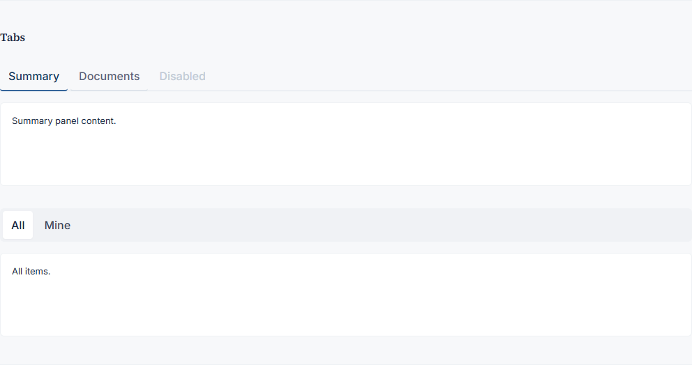

### DO / DON'T (from Phase 5 polish)

- **DO:** compose with tokens from [`TOKENS.md`](./TOKENS.md); meet focus-ring / target-size patterns in this file’s earlier sections.
- **DON'T:** add tooltips; ship `framer-motion` on new surfaces; hardcode tenant marketing strings in primitives.

### Accessibility

- Keyboard: focus order follows DOM; interactive cells use native controls or `role` + key handlers where applicable.
- See **Lighthouse accessibility** section above for gate hygiene.

### Minimal example

```tsx
import { Tabs } from "@/components/forge";
```

### Related

- [`POLISH.md`](./POLISH.md) Phase 5 Items 2–5 · [`MIGRATION.md`](./MIGRATION.md)

### Compose vs extend

- **Compose** in page/feature modules under `components/forge/credit-hub/**`.
- **Extend** the primitive only when a new variant is reusable across personas (then update preview + this doc).

---

## Textarea

**File:** `components/forge/ui/Textarea.tsx` · **Lines:** 82

**Purpose:** Forge design-system primitive `Textarea` — see barrel export in `components/forge/index.ts`. Legacy `components/credit-hub/**` is **out of scope** for this catalog (Phase 7.2 Case B).

**Props:** See source for `export interface …Props` and runtime props.

### Variants & states (preview)

Captured from [`/credit-hub/preview`](../preview) — regenerate via `npm run docs:components`.

_No dedicated capture slice yet — use full preview section or add capture mapping in `generate-component-catalog.mjs`._

### DO / DON'T (from Phase 5 polish)

- **DO:** compose with tokens from [`TOKENS.md`](./TOKENS.md); meet focus-ring / target-size patterns in this file’s earlier sections.
- **DON'T:** add tooltips; ship `framer-motion` on new surfaces; hardcode tenant marketing strings in primitives.

### Accessibility

- Keyboard: focus order follows DOM; interactive cells use native controls or `role` + key handlers where applicable.
- See **Lighthouse accessibility** section above for gate hygiene.

### Minimal example

```tsx
import { Textarea } from "@/components/forge";
```

### Related

- [`POLISH.md`](./POLISH.md) Phase 5 Items 2–5 · [`MIGRATION.md`](./MIGRATION.md)

### Compose vs extend

- **Compose** in page/feature modules under `components/forge/credit-hub/**`.
- **Extend** the primitive only when a new variant is reusable across personas (then update preview + this doc).

---

## Toast

**File:** `components/forge/ui/Toast.tsx` · **Lines:** 32

**Purpose:** Forge design-system primitive `Toast` — see barrel export in `components/forge/index.ts`. Legacy `components/credit-hub/**` is **out of scope** for this catalog (Phase 7.2 Case B).

**Props:** See source for `export interface …Props` and runtime props.

### Variants & states (preview)

Captured from [`/credit-hub/preview`](../preview) — regenerate via `npm run docs:components`.


### DO / DON'T (from Phase 5 polish)

- **DO:** compose with tokens from [`TOKENS.md`](./TOKENS.md); meet focus-ring / target-size patterns in this file’s earlier sections.
- **DON'T:** add tooltips; ship `framer-motion` on new surfaces; hardcode tenant marketing strings in primitives.

### Accessibility

- Keyboard: focus order follows DOM; interactive cells use native controls or `role` + key handlers where applicable.
- See **Lighthouse accessibility** section above for gate hygiene.

### Minimal example

```tsx
import { ForgeToaster, toast } from "@/components/forge";
```

### Related

- [`POLISH.md`](./POLISH.md) Phase 5 Items 2–5 · [`MIGRATION.md`](./MIGRATION.md)

### Compose vs extend

- **Compose** in page/feature modules under `components/forge/credit-hub/**`.
- **Extend** the primitive only when a new variant is reusable across personas (then update preview + this doc).

---

## ForgeCommandPaletteContext

**File:** `components/forge/layout/ForgeCommandPaletteContext.tsx` · **Lines:** 54

**Purpose:** Forge design-system primitive `ForgeCommandPaletteContext` — see barrel export in `components/forge/index.ts`. Legacy `components/credit-hub/**` is **out of scope** for this catalog (Phase 7.2 Case B).

**Props:** See source for `export interface …Props` and runtime props.

### Variants & states (preview)

Captured from [`/credit-hub/preview`](../preview) — regenerate via `npm run docs:components`.

_No dedicated capture slice yet — use full preview section or add capture mapping in `generate-component-catalog.mjs`._

### DO / DON'T (from Phase 5 polish)

- **DO:** compose with tokens from [`TOKENS.md`](./TOKENS.md); meet focus-ring / target-size patterns in this file’s earlier sections.
- **DON'T:** add tooltips; ship `framer-motion` on new surfaces; hardcode tenant marketing strings in primitives.

### Accessibility

- Keyboard: focus order follows DOM; interactive cells use native controls or `role` + key handlers where applicable.
- See **Lighthouse accessibility** section above for gate hygiene.

### Minimal example

```tsx
import { ForgeCommandPaletteContext } from "@/components/forge";
```

### Related

- [`POLISH.md`](./POLISH.md) Phase 5 Items 2–5 · [`MIGRATION.md`](./MIGRATION.md)

### Compose vs extend

- **Compose** in page/feature modules under `components/forge/credit-hub/**`.
- **Extend** the primitive only when a new variant is reusable across personas (then update preview + this doc).

---

## ForgeCreditHubAppShell

**File:** `components/forge/layout/ForgeCreditHubAppShell.tsx`

**Purpose:** Credit Hub shell — `PersonaProvider`, `CHTenantGuard`, `ForgeCommandPaletteProvider`, and **`ForgeAppShell`** with **`ForgeCreditHubSidebar`** + **`ForgeCreditHubTopbar`**. Use this for **`/credit-hub/*`** only. For non–Credit Hub modules (e.g. Legal under **`/legal`**), use **`ForgeAppShell`** + **`ForgeAppSidebar`** directly in that route’s layout (no `PersonaProvider`, no command palette in v1).

**Props:** `{ children: ReactNode }`

### When to use which shell

| Shell | Route | Persona | Command palette |
|-------|-------|---------|-----------------|
| **`ForgeCreditHubAppShell`** | `/credit-hub/*` | Yes (`bank` / `dealer`) | Yes (Ctrl/Cmd-K) |
| **`ForgeAppShell`** + **`ForgeAppSidebar`** | e.g. `/legal/*` | No | Not mounted (Legal v1) |

### Minimal example (Legal layout pattern)

```tsx
import { ForgeAppShell } from "@/components/forge/layout/ForgeAppShell";
import { ForgeAppSidebar } from "@/components/forge/layout/ForgeAppSidebar";
import { ForgeAppTopbar } from "@/components/forge/layout/ForgeAppTopbar";

<ForgeAppShell sidebar={<ForgeAppSidebar />} topbar={<ForgeAppTopbar module="legal" />}>
  {children}
</ForgeAppShell>
```

### Variants & states (preview)

Captured from [`/credit-hub/preview`](../preview) — regenerate via `npm run docs:components`.

_No dedicated capture slice yet — use full preview section or add capture mapping in `generate-component-catalog.mjs`._

### DO / DON'T (from Phase 5 polish)

- **DO:** compose with tokens from [`TOKENS.md`](./TOKENS.md); meet focus-ring / target-size patterns in this file’s earlier sections.
- **DON'T:** add tooltips; ship `framer-motion` on new surfaces; hardcode tenant marketing strings in primitives.

### Accessibility

- Keyboard: focus order follows DOM; interactive cells use native controls or `role` + key handlers where applicable.
- See **Lighthouse accessibility** section above for gate hygiene.

### Minimal example

```tsx
import { ForgeCreditHubAppShell } from "@/components/forge";
```

### Related

- [`POLISH.md`](./POLISH.md) Phase 5 Items 2–5 · [`MIGRATION.md`](./MIGRATION.md)

### Compose vs extend

- **Compose** in page/feature modules under `components/forge/credit-hub/**`.
- **Extend** the primitive only when a new variant is reusable across personas (then update preview + this doc).

---

## ForgeCreditHubCommandPalette

**File:** `components/forge/layout/ForgeCreditHubCommandPalette.tsx` · **Lines:** 273

**Purpose:** Forge design-system primitive `ForgeCreditHubCommandPalette` — see barrel export in `components/forge/index.ts`. Legacy `components/credit-hub/**` is **out of scope** for this catalog (Phase 7.2 Case B).

**Props:** See source for `export interface …Props` and runtime props.

### Variants & states (preview)

Captured from [`/credit-hub/preview`](../preview) — regenerate via `npm run docs:components`.

_No dedicated capture slice yet — use full preview section or add capture mapping in `generate-component-catalog.mjs`._

### DO / DON'T (from Phase 5 polish)

- **DO:** compose with tokens from [`TOKENS.md`](./TOKENS.md); meet focus-ring / target-size patterns in this file’s earlier sections.
- **DON'T:** add tooltips; ship `framer-motion` on new surfaces; hardcode tenant marketing strings in primitives.

### Accessibility

- Keyboard: focus order follows DOM; interactive cells use native controls or `role` + key handlers where applicable.
- See **Lighthouse accessibility** section above for gate hygiene.

### Minimal example

```tsx
import { ForgeCreditHubCommandPalette } from "@/components/forge";
```

### Related

- [`POLISH.md`](./POLISH.md) Phase 5 Items 2–5 · [`MIGRATION.md`](./MIGRATION.md)

### Compose vs extend

- **Compose** in page/feature modules under `components/forge/credit-hub/**`.
- **Extend** the primitive only when a new variant is reusable across personas (then update preview + this doc).

---

## ForgeCreditHubSidebar

**File:** `components/forge/layout/ForgeCreditHubSidebar.tsx` · **Lines:** 110

**Purpose:** Forge design-system primitive `ForgeCreditHubSidebar` — see barrel export in `components/forge/index.ts`. Legacy `components/credit-hub/**` is **out of scope** for this catalog (Phase 7.2 Case B).

**Props:** See source for `export interface …Props` and runtime props.

### Variants & states (preview)

Captured from [`/credit-hub/preview`](../preview) — regenerate via `npm run docs:components`.

_No dedicated capture slice yet — use full preview section or add capture mapping in `generate-component-catalog.mjs`._

### DO / DON'T (from Phase 5 polish)

- **DO:** compose with tokens from [`TOKENS.md`](./TOKENS.md); meet focus-ring / target-size patterns in this file’s earlier sections.
- **DON'T:** add tooltips; ship `framer-motion` on new surfaces; hardcode tenant marketing strings in primitives.

### Accessibility

- Keyboard: focus order follows DOM; interactive cells use native controls or `role` + key handlers where applicable.
- See **Lighthouse accessibility** section above for gate hygiene.

### Minimal example

```tsx
import { ForgeCreditHubSidebar } from "@/components/forge";
```

### Related

- [`POLISH.md`](./POLISH.md) Phase 5 Items 2–5 · [`MIGRATION.md`](./MIGRATION.md)

### Compose vs extend

- **Compose** in page/feature modules under `components/forge/credit-hub/**`.
- **Extend** the primitive only when a new variant is reusable across personas (then update preview + this doc).

---

## ForgeCreditHubTopbar

**File:** `components/forge/layout/ForgeCreditHubTopbar.tsx` · **Lines:** 31

**Purpose:** Forge design-system primitive `ForgeCreditHubTopbar` — see barrel export in `components/forge/index.ts`. Legacy `components/credit-hub/**` is **out of scope** for this catalog (Phase 7.2 Case B).

**Props:** See source for `export interface …Props` and runtime props.

### Variants & states (preview)

Captured from [`/credit-hub/preview`](../preview) — regenerate via `npm run docs:components`.

_No dedicated capture slice yet — use full preview section or add capture mapping in `generate-component-catalog.mjs`._

### DO / DON'T (from Phase 5 polish)

- **DO:** compose with tokens from [`TOKENS.md`](./TOKENS.md); meet focus-ring / target-size patterns in this file’s earlier sections.
- **DON'T:** add tooltips; ship `framer-motion` on new surfaces; hardcode tenant marketing strings in primitives.

### Accessibility

- Keyboard: focus order follows DOM; interactive cells use native controls or `role` + key handlers where applicable.
- See **Lighthouse accessibility** section above for gate hygiene.

### Minimal example

```tsx
import { ForgeCreditHubTopbar } from "@/components/forge";
```

### Related

- [`POLISH.md`](./POLISH.md) Phase 5 Items 2–5 · [`MIGRATION.md`](./MIGRATION.md)

### Compose vs extend

- **Compose** in page/feature modules under `components/forge/credit-hub/**`.
- **Extend** the primitive only when a new variant is reusable across personas (then update preview + this doc).

---

## ForgeAppShell

**File:** `components/forge/layout/ForgeAppShell.tsx`

**Purpose:** Agnostic two-column layout: **sidebar** + **topbar** + **`<main id="main-content">`**. Optional **`beforeContent`** (e.g. Credit Hub token debug span). Does **not** mount command palette — Credit Hub wraps this tree with **`ForgeCommandPaletteProvider`**.

**Primary props interface:** `ForgeAppShellProps`

```ts
sidebar: ReactNode;
topbar: ReactNode;
children: ReactNode;
beforeContent?: ReactNode;
```

### Related

- **`ForgeCreditHubAppShell`** · **`ForgeAppSidebar`** · **`ForgeAppTopbar`**

---

## ForgeAppSidebar

**File:** `components/forge/layout/ForgeAppSidebar.tsx`

**Purpose:** Multi-tenant **module** navigation. Uses **`useTenantModules()`** (TanStack Query → **`GET /api/v1/tenants/{tenantId}/modules`**) where **`modules`** is an array of **`{ slug, label, enabled, … }`** (no separate `catalog` field). Only slugs in **`IMPLEMENTED_MODULE_SLUGS`** (currently `credit`, `legal`) render until more UIs ship; **labels come from the backend** response.

### DO / DON'T

- **DO:** add new rows to the internal registry with backend `module` ids that match the API.
- **DON'T:** conflate Credit Hub **persona** (`bank`/`dealer`) with module gating — persona stays in **`ForgeCreditHubSidebar`**.

---

## ForgeAppTopbar

**File:** `components/forge/layout/ForgeAppTopbar.tsx`

**Purpose:** Top bar for non–Credit Hub Forge routes. Today supports **`module="legal"`** (institution title + “Legal Intelligence”). Composes primitive **`Topbar`**.

**Primary props interface:** `ForgeAppTopbarProps`

```ts
module: "legal";
```

---

## Sidebar

**File:** `components/forge/layout/Sidebar.tsx` · **Lines:** 54

**Purpose:** Forge design-system primitive `Sidebar` — see barrel export in `components/forge/index.ts`. Legacy `components/credit-hub/**` is **out of scope** for this catalog (Phase 7.2 Case B).

**Primary props interface:** `SidebarProps`

```ts
brand: ReactNode;
items: SidebarNavItem[];
footer?: ReactNode;
className?: string;
```

### Variants & states (preview)

Captured from [`/credit-hub/preview`](../preview) — regenerate via `npm run docs:components`.

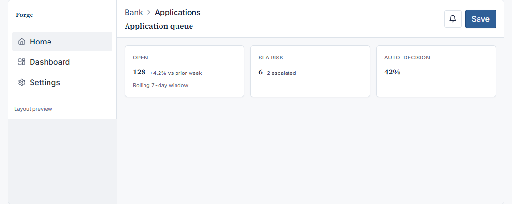

### DO / DON'T (from Phase 5 polish)

- **DO:** compose with tokens from [`TOKENS.md`](./TOKENS.md); meet focus-ring / target-size patterns in this file’s earlier sections.
- **DON'T:** add tooltips; ship `framer-motion` on new surfaces; hardcode tenant marketing strings in primitives.

### Accessibility

- Keyboard: focus order follows DOM; interactive cells use native controls or `role` + key handlers where applicable.
- See **Lighthouse accessibility** section above for gate hygiene.

### Minimal example

```tsx
import { Sidebar } from "@/components/forge";
```

### Related

- [`POLISH.md`](./POLISH.md) Phase 5 Items 2–5 · [`MIGRATION.md`](./MIGRATION.md)

### Compose vs extend

- **Compose** in page/feature modules under `components/forge/credit-hub/**`.
- **Extend** the primitive only when a new variant is reusable across personas (then update preview + this doc).

---

## Topbar

**File:** `components/forge/layout/Topbar.tsx` · **Lines:** 30

**Purpose:** Forge design-system primitive `Topbar` — see barrel export in `components/forge/index.ts`. Legacy `components/credit-hub/**` is **out of scope** for this catalog (Phase 7.2 Case B).

**Primary props interface:** `TopbarProps`

```ts
title: string;
/** Optional row above title (e.g. breadcrumbs). */
leading?: ReactNode;
actions?: ReactNode;
className?: string;
```

### Variants & states (preview)

Captured from [`/credit-hub/preview`](../preview) — regenerate via `npm run docs:components`.


### DO / DON'T (from Phase 5 polish)

- **DO:** compose with tokens from [`TOKENS.md`](./TOKENS.md); meet focus-ring / target-size patterns in this file’s earlier sections.
- **DON'T:** add tooltips; ship `framer-motion` on new surfaces; hardcode tenant marketing strings in primitives.

### Accessibility

- Keyboard: focus order follows DOM; interactive cells use native controls or `role` + key handlers where applicable.
- See **Lighthouse accessibility** section above for gate hygiene.

### Minimal example

```tsx
import { Topbar } from "@/components/forge";
```

### Related

- [`POLISH.md`](./POLISH.md) Phase 5 Items 2–5 · [`MIGRATION.md`](./MIGRATION.md)

### Compose vs extend

- **Compose** in page/feature modules under `components/forge/credit-hub/**`.
- **Extend** the primitive only when a new variant is reusable across personas (then update preview + this doc).

---

## creditHubPersonaFromSegments

**File:** `components/forge/layout/creditHubPersonaFromSegments.ts` · **Lines:** 14

**Purpose:** Forge design-system primitive `creditHubPersonaFromSegments` — see barrel export in `components/forge/index.ts`. Legacy `components/credit-hub/**` is **out of scope** for this catalog (Phase 7.2 Case B).

**Props:** See source for `export interface …Props` and runtime props.

### Variants & states (preview)

Captured from [`/credit-hub/preview`](../preview) — regenerate via `npm run docs:components`.

_No dedicated capture slice yet — use full preview section or add capture mapping in `generate-component-catalog.mjs`._

### DO / DON'T (from Phase 5 polish)

- **DO:** compose with tokens from [`TOKENS.md`](./TOKENS.md); meet focus-ring / target-size patterns in this file’s earlier sections.
- **DON'T:** add tooltips; ship `framer-motion` on new surfaces; hardcode tenant marketing strings in primitives.

### Accessibility

- Keyboard: focus order follows DOM; interactive cells use native controls or `role` + key handlers where applicable.
- See **Lighthouse accessibility** section above for gate hygiene.

### Minimal example

```tsx
import { creditHubPersonaFromSegments } from "@/components/forge";
```

### Related

- [`POLISH.md`](./POLISH.md) Phase 5 Items 2–5 · [`MIGRATION.md`](./MIGRATION.md)

### Compose vs extend

- **Compose** in page/feature modules under `components/forge/credit-hub/**`.
- **Extend** the primitive only when a new variant is reusable across personas (then update preview + this doc).

---

<!-- PHASE8_PRIMITIVE_CATALOG_END -->


