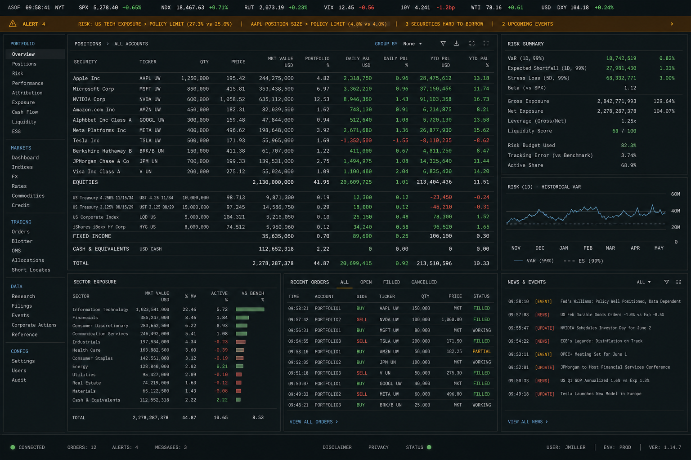
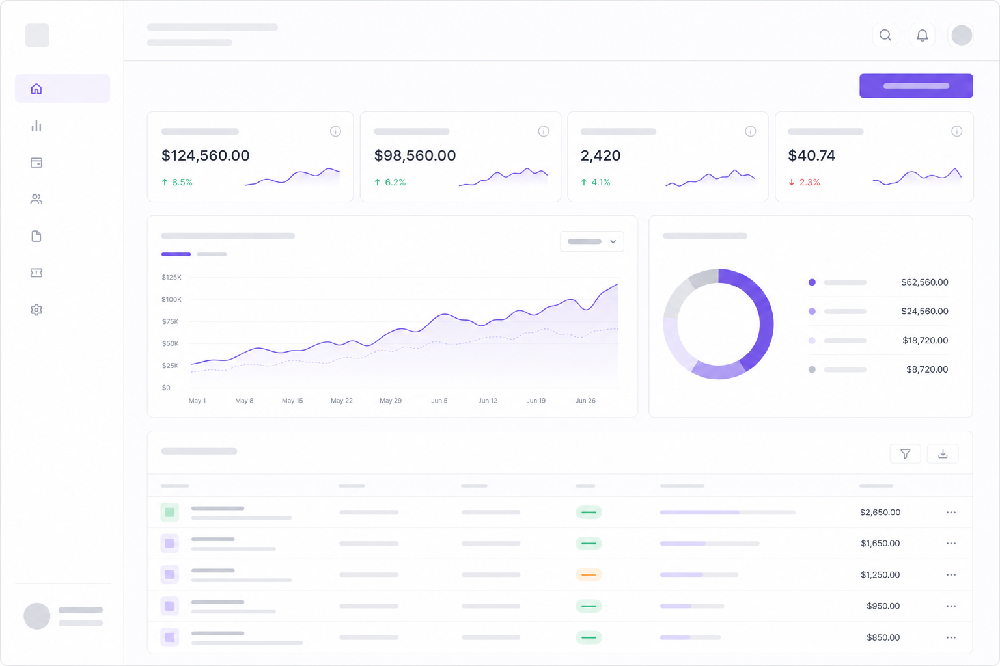
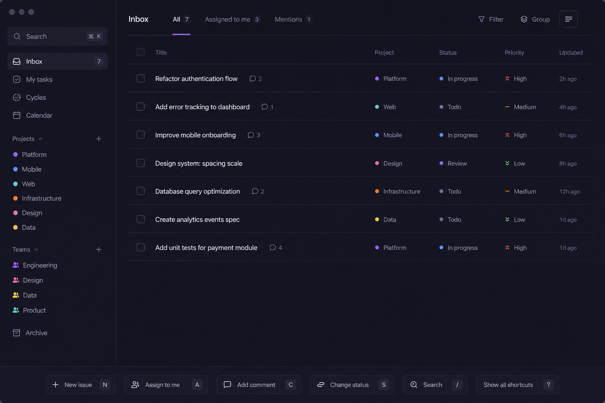
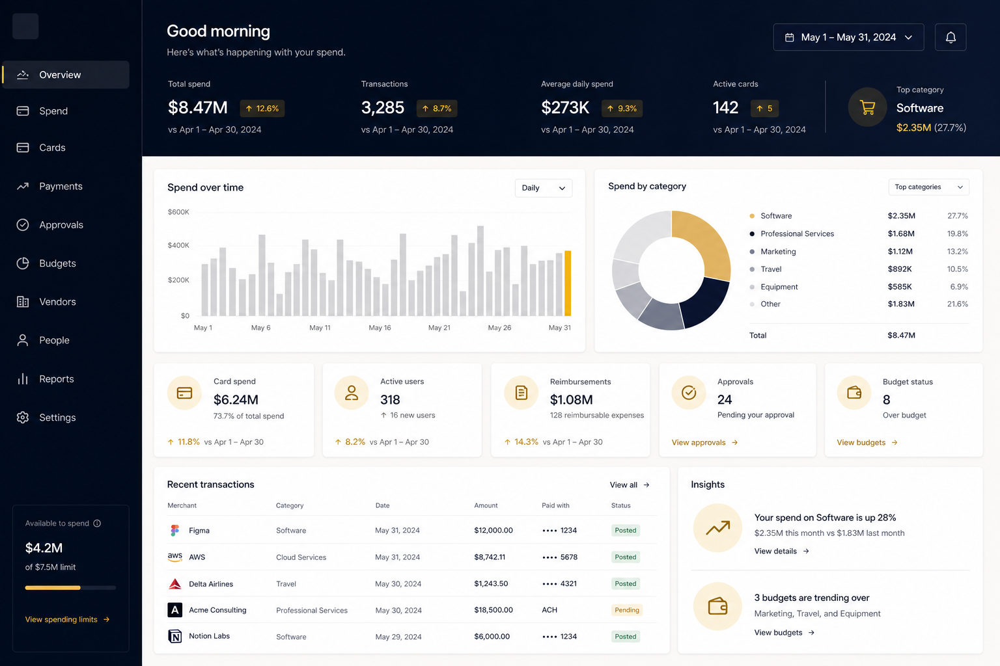
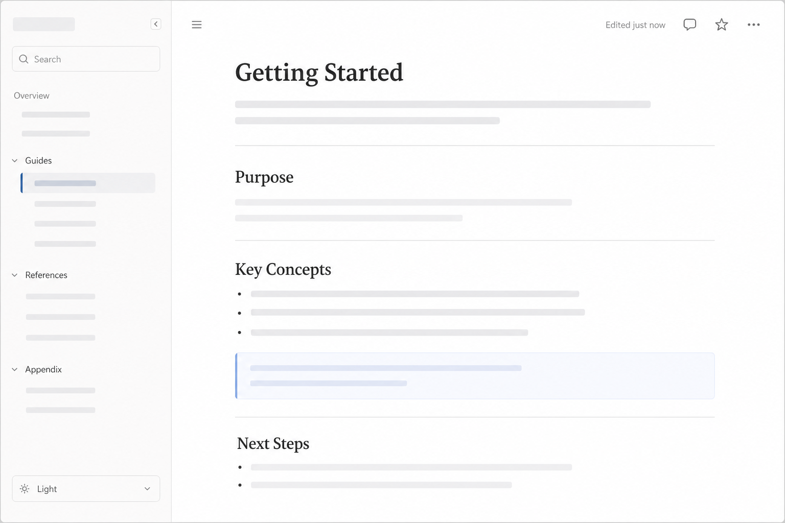
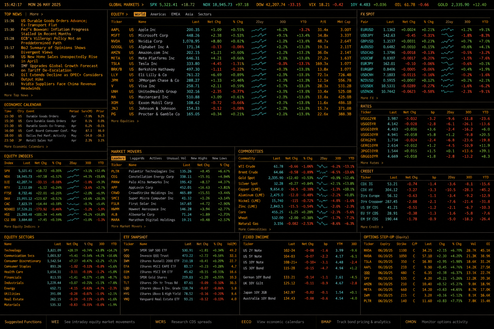

# Forge Credit Hub — design system

English technical reference. For tenant onboarding in Spanish, see **`TENANT_THEMING.md`** (Phase 8). This document states **non-negotiables** enforced across Phases 1–7 and the **visual benchmarks** that guided v3.2.

---

## 1. Visual philosophy — ten principles (master prompt v3.2)

These principles translate the institutional fintech bar into day-to-day decisions:

1. **Institutional first** — Calm, audit-friendly surfaces; no consumer “gloss” gradients or glassmorphism as the default chrome.
2. **Borders over blobs** — Structure and hierarchy come from **ink**, **hairline borders**, and **spacing**; shadows are subtle and functional—not hero decorations.
3. **Token discipline** — New Forge surfaces use **`tokens.css`** custom properties on **`.forge-app`**; avoid new arbitrary hex in JSX except data-viz with a documented map.
4. **Two personas, one system** — **Bank** (light institutional default) and **dealer** (portal styling via `data-portal` / layout) share primitives; persona-specific chrome lives in layout modules, not duplicated button APIs.
5. **Readable at a glance** — Type scale and contrast target **WCAG AA**; focus rings are **2px** `forgeBrand-500` with offset on interactive controls (`COMPONENTS.md`).
6. **Motion is optional** — No **framer-motion** (removed Phase 7). Prefer **CSS transitions**, **`prefers-reduced-motion`**, and **`lib/motion-stub.tsx`** only for legacy JSX compatibility.
7. **Touch-safe density** — Minimum target sizes for critical controls; tables on small viewports use **density + horizontal scroll inside the table**, not a second undocumented mobile component (`DataTable` strategy in `COMPONENTS.md`).
8. **Explicit empty and error states** — Use **`EmptyState`** and copy helpers; no silent failures or placeholder-only rows.
9. **Locale-aware copy** — Tenant locale drives EN/ES helpers (`utils/forge-*-copy.ts`); do not hardcode institution marketing names in heroes (Phase 7 tenant coupling sweep).
10. **Documented seams** — Where legacy **`components/credit-hub/**`** remains (Case B), Tailwind **permanent legacy aliases** + **`styles/forge-tokens.css`** stay until a migration empties consumer grep—see `MIGRATION.md`.

---

## 2. Visual benchmarks

Forge targets **dense, trustworthy** operator UIs—not marketing microsites. The PNGs below are **original directional composites** generated for offline documentation (they are **not** screenshots of third-party products). Use them for **mood and density**; compare against the **live products** at the linked URLs for authoritative UI.

| Image | Alt | What we borrow | Live reference (open in browser) | Captured |
|-------|-----|----------------|----------------------------------|------------|
|  | Dark institutional dashboard with dense columns and status color | Data density, monospace numerals, restrained green/red semantics | [Marquee](https://www.goldmansachs.com/) (product marketing; institutional terminal style) | 2026-04-29 |
|  | Light minimal dashboard with hairline borders | Quiet cards, single accent, generous whitespace | [Stripe Dashboard](https://stripe.com/) | 2026-04-29 |
|  | Dark list-first productivity UI | Keyboard-first lists, subtle row chrome, command affordances | [Linear](https://linear.app/) | 2026-04-29 |
|  | Navy header, gold accent spend view | Premium corporate card aesthetic without neon | [Brex](https://www.brex.com/) (corporate spend / expense product family) | 2026-04-29 |
|  | Light sidebar + document canvas | Sidebar IA, long-form readability, soft dividers | [Notion](https://www.notion.so/) | 2026-04-29 |
|  | Black terminal grid with amber/cyan accents | Terminal-grade density, monospace grid (Forge bank analytics lean here) | [Bloomberg Terminal](https://en.wikipedia.org/wiki/Bloomberg_Terminal) (encyclopedic overview; vendor site may block automated checks) | 2026-04-29 |

**Fair use / institutional reference:** The composites above are **original artwork** for internal design documentation to reduce copyright risk. They **do not** reproduce proprietary layouts. When presenting to executives, prefer **live URLs** or licensed press imagery from the vendors themselves.

---

## 3. Anti-patterns (build- and merge-rejecting themes)

Phase 0 **`AUDIT.md`** records **numbered findings** (items 5–40+) against the older stack—radius drift, literal hex, gradients on primaries, glass shadows, duplicate toast systems, URL `href="#"` IA, missing shared `DataTable`, etc. The master prompt’s **“23 violations”** cluster maps to the **radius / shadow / motion / gradient** family (see AUDIT §8 **finding 23** onward: e.g. **`rounded-2xl` / `rounded-3xl`** beyond v3.2 card max, **`shadow-2xl` + `backdrop-blur`** on toasts, **`forge-float`**, **`active:scale`** on marketing buttons).

**Do not reintroduce** on new Forge surfaces:

- **Consumer gradients + scale bounce** on primary actions (institutional primaries are flat/token-driven).
- **Heavy glass / blur chrome** as the default overlay (scrim is tokenized `forge-surface-overlay`).
- **Tooltip-dependent UX** — tooltips are **formally absent**; use visible copy, `aria-describedby`, helper text (`COMPONENTS.md` Phase 7).
- **JS animation libraries** for layout chrome (Phase 7 eliminated **framer-motion** from runtime).
- **Hardcoded tenant marketing** in bank heroes (use `useTenantConfig().institution_name` and related fields).
- **Undocumented mobile table patterns** — use **`DataTable`** density + wrapper scroll; **`DataTableMobileCard`** was **not built** by design.

For the exhaustive audit trail, always read **`AUDIT.md`** alongside this summary.

---

## 4. Architectural rules (Phases 1–7)

| Rule | Evidence / detail |
|------|-------------------|
| **No JS animation library** | `framer-motion` removed; `lib/motion-stub.tsx`; CSS **`PullToRefresh`** (`POLISH.md` 7.1). |
| **No tooltips** | Formalized absence Phase 7 / `COMPONENTS.md`. |
| **Permanent legacy Tailwind adapter** | Phase 7.2 **Case B** — `tailwind.config.js` PERMANENT LEGACY ALIASES; `styles/forge-tokens.css` preserved; grep `_design/_inventory/credit_hub_consumers_grep.txt`. |
| **Mobile strategy** | **`DataTable`**: `compact` / `dense` + `overflow-x-auto` + `min-w-0` on cells; no **`DataTableMobileCard`** in tree. |
| **Forge primitives only in COMPONENTS catalog** | `components/forge/ui/*` + `components/forge/layout/*` (except legacy **`components/credit-hub/**`**, which is **out of scope** for the design-system doc). |
| **Single toaster hosts** | `ForgeCreditHubAppShell` for `/credit-hub/*`; `CreditForgeToaster` in `app/credit/layout.tsx` for legacy uploader (`COMPONENTS.md`). |
| **Lighthouse hygiene** | Fresh `next build --webpack` + single `next start` before gating; Windows `EPERM` launcher note in `COMPONENTS.md`. |

---

## 5. When to extend vs. compose vs. refuse

| Situation | Prefer |
|-----------|--------|
| New **color** for charts only | **Extend** `tokens.css` semantic data-viz map + document in `TOKENS.md`. |
| New **button intent** (e.g. warning) | **Extend** `Button` variants with token-backed classes + `COMPONENTS.md` matrix. |
| Bank-only **layout** chrome | **Compose** existing primitives in `components/forge/credit-hub/*` or page files—**do not** fork `Button`. |
| “**Just this once**” arbitrary hex in a page | **Refuse** — add token or use existing scale; track in audit grep. |
| **Tooltip** for “more info” | **Refuse** — redesign copy/layout (`COMPONENTS.md`). |
| **URL-derived persona** long term | **Defer then replace** — `TENANT_CONTEXT_EXTENSION.md`; today’s seam is documented in `COMPONENTS.md` (Phase 8 target). |

---

## 6. Related files

- **Token source:** [`tokens.css`](./tokens.css)  
- **Primitive rules:** [`COMPONENTS.md`](./COMPONENTS.md)  
- **Phase evidence:** [`POLISH.md`](./POLISH.md), [`REUSABILITY_TEST.md`](./REUSABILITY_TEST.md)  
- **Baseline drift catalog:** [`AUDIT.md`](./AUDIT.md)  
- **Legacy adapter:** [`MIGRATION.md`](./MIGRATION.md)

---

## 7. Changelog pointer

Release notes for the overall dashboard live at repository root **`CHANGELOG.md`** (Phase 8 final asks for **v1.0.0** entry when all phases close).
