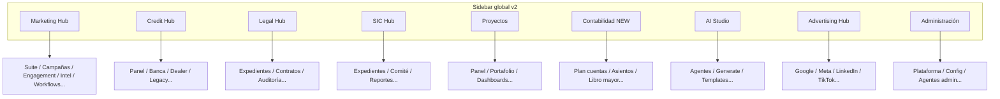

# Sidebar global v2 — Notion-style cores

Documentación de la navegación global del dashboard Nadakki AI Suite (v2).

## Diagrama de los 9 Cores

## Cores oficiales

| ID | Label | Icon | coreMatchers | Sub-items |
|---|---|---|---|---|
| `marketing-hub` | Marketing Hub | Megaphone | `marketing` | Suite, campañas, engagement, inteligencia, contenido, agentes, workflows |
| `credit-hub` | Credit Hub | Landmark | `credit` | Panel, banca, dealer, solicitudes, legacy, decisioning |
| `legal-hub` | Legal Hub | Scale | `legal` | Inicio, expedientes, contratos, investigación, auditoría |
| `sic-hub` | SIC Hub | FileSpreadsheet | `sic`, `platform` | Dashboard, expedientes, comité, reportes, config |
| `projects-hub` | Proyectos | Building2 | `projects` | Panel, portafolio, dashboards, nuevo proyecto |
| `contable-hub` | Contabilidad | BookOpen | `platform`, `projects` | 6 rutas `/contable/*` |
| `ai-studio-hub` | AI Studio | Sparkles | `marketing`, `platform` | 6 rutas `/ai-studio/*` + agentes globales |
| `advertising-hub` | Advertising Hub | Target | `marketing` | 8 rutas `/advertising/*` |
| `admin` | Administración | Settings | _(vacío)_ | Plataforma, config, agentes (requiere rol admin) |

## Permisos y filtrado

- **Cores:** siempre visibles (9 cores en todo momento).
- **Sub-items:** filtrados por:
  - `tenant.subscribed_cores` + `coreMatchers` del core padre
  - Roles con acceso al core (`allRoles[].core_name`)
  - `tenant_admin` / `platform_superadmin` ven todos los sub-items
  - `superAdminOnly: true` en items de admin
- **Core sin sub-items visibles:** mensaje *"Módulo no disponible en tu plan"*.

Función principal: `filterSectionsForUser()` en `components/forge/layout/forge-global-sidebar-nav.ts`.

## Persistencia expand/collapse

- Clave: `forge-global-sidebar-expanded-v2` (localStorage)
- Default: solo el core de la ruta activa se expande automáticamente
- Click en core: toggle manual

## Estilo visual (Notion/Linear)

| Elemento | Clases |
|---|---|
| Core header | `text-sm font-semibold text-zinc-100 px-3 py-2` |
| Core activo | `bg-violet-500/10 text-violet-300 border-l-2 border-violet-500` |
| Sub-item | `text-xs pl-9 text-zinc-400` |
| Sub-item activo | `text-violet-300 bg-violet-500/5 border-l-2 border-violet-500` |
| Branding fallback | `"Nadakki AI Suite"` |

## Cómo agregar un Core nuevo

1. Añadir entrada en `NAV_SECTIONS` (o `NAV_CORES`) en `forge-global-sidebar-nav.ts`:
   - `id`, `label`, `icon`, `coreMatchers`, `alwaysVisible: true`, `children`
2. Registrar theme en `forge-sidebar-core-themes.ts` (`SIDEBAR_SECTION_TO_THEME` + `SIDEBAR_CORE_THEMES`).
3. Verificar que la ruta existe: `app/**/page.tsx`.
4. Ejecutar `npm run build`.
5. Actualizar este documento.

## Items huérfanos / decisiones de IA

Rutas existentes **sin link directo** en sidebar (acceso solo vía deep link o rutas dinámicas):

| Ruta | Decisión |
|---|---|
| `/proyectos/[id]/*` | Dinámico — navegación dentro del workspace del proyecto |
| `/legal/cases/[id]/*` | Dinámico — detalle de expediente |
| `/sic/expedientes/[id]/*` | Dinámico — detalle SIC |
| `/marketing/campaigns/[id]` | Dinámico — detalle campaña |
| `/credit/[id]/*`, `/credit/dealer/*` | Legacy — links bajo Credit Hub legacy group |
| `/[core]/[agentId]` | Dinámico — agent router |
| `/login`, `/consent/[token]` | Público — fuera del sidebar |
| `/testing/*`, `/export`, `/reports`, `/notifications`, `/institutions`, `/audit` | Utilidades / QA — ocultos (deep link) |
| `/onboarding/observability` | Observability interno — oculto |
| `/m/upload/[token]` | Upload token público — oculto |

Rutas **reclasificadas bajo Marketing Hub** (antes huérfanas):

- `/analytics/*`, `/social/*`, `/email/*`, `/campaigns/*`, `/segments/*`, `/leads/*`, `/audiences/*`, `/content/*`, `/library/*`, `/automations/*`, `/scheduler/*`, `/intelligence/*`, `/competitor-research`, `/orchestration`

Rutas **promovidas a core propio**:

- `/contable/*` → Contabilidad
- `/ai-studio/*` → AI Studio
- `/advertising/*` → Advertising Hub (extraído de Marketing)

**Workflows:** ya no es core de primer nivel; vive bajo Marketing Hub → Workflows.

## Archivos involucrados

- `components/forge/layout/forge-global-sidebar-nav.ts` — árbol NAV + RBAC
- `components/forge/layout/ForgeGlobalCoresSidebar.tsx` — render Notion-style
- `components/forge/layout/forge-sidebar-core-themes.ts` — iconos/colores por core
